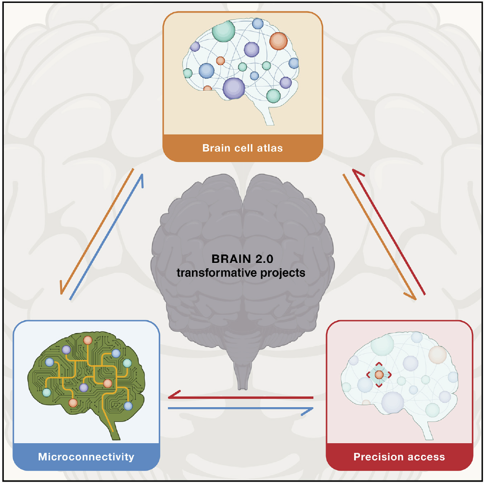
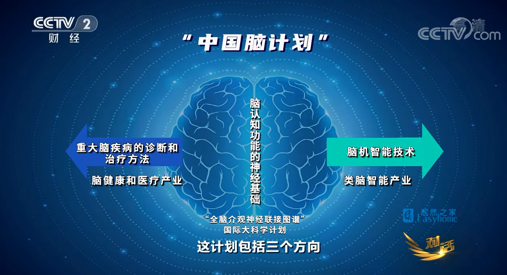
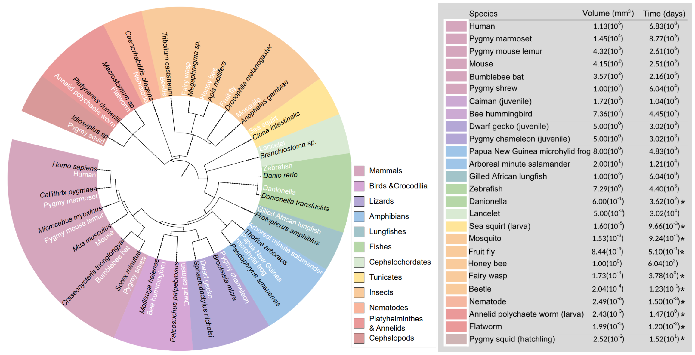
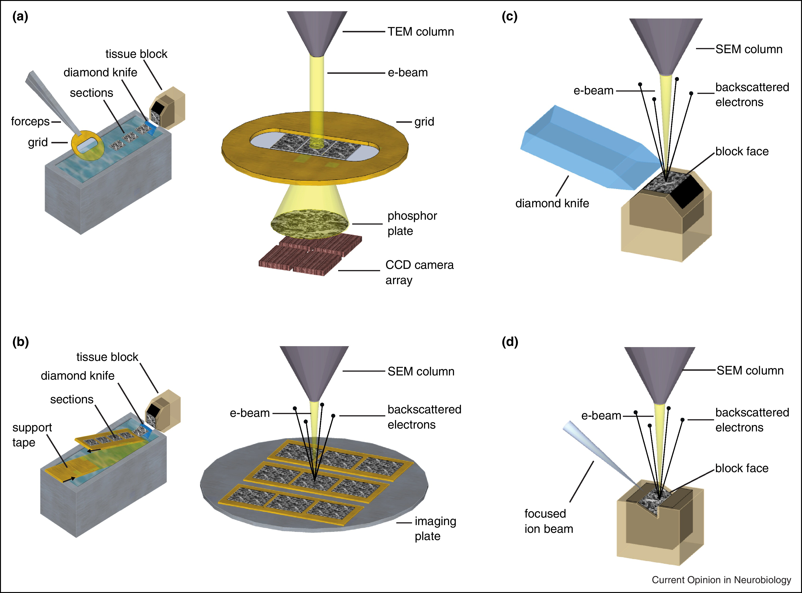
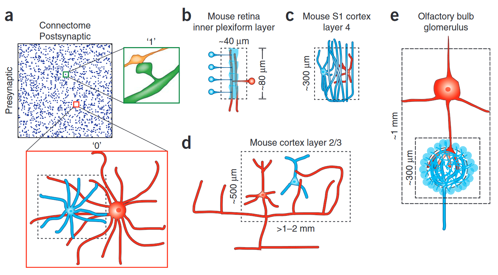
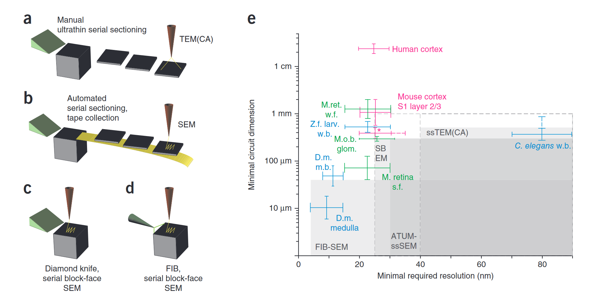
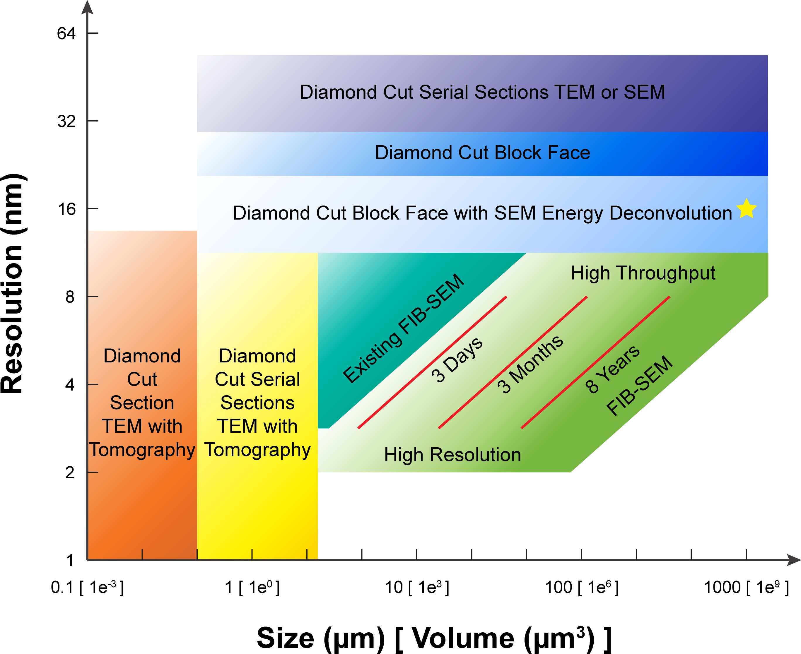
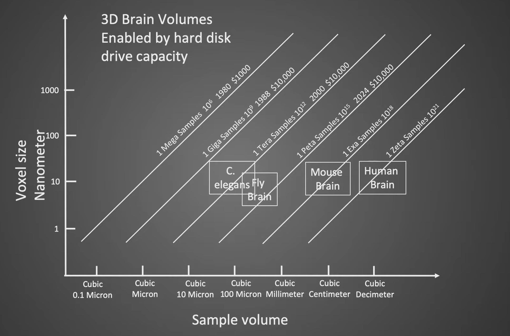
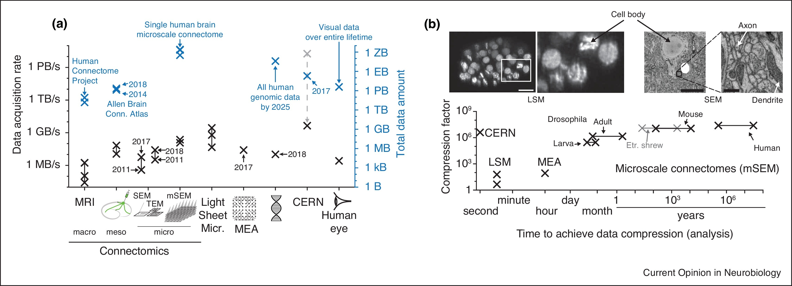

# Background: A Primer on Volume EM

*What volume electron microscopy is, how vEM datasets are made, and why they look the way they do.* &nbsp;[&larr; back to the list](README.md)

* [What is Volume EM?](#what-is-volume-em)
* [A Short History in Datasets](#a-short-history-in-datasets)
* [Imaging Techniques](#imaging-techniques)
* [Sample Preparation](#sample-preparation)
* [From Images to Connectomes](#from-images-to-connectomes)
* [Data Scale and Infrastructure](#data-scale-and-infrastructure)
* [Programs and Initiatives](#programs-and-initiatives)
* [Species](#species) · [Microscopy](#microscopy) · [Size and Resolution](#size-and-resolution)

## What is Volume EM?

**Volume electron microscopy (vEM)** is a family of techniques that image a resin-embedded, heavy-metal-stained specimen as a stack of hundreds to tens of thousands of serial electron micrographs, producing a three-dimensional image with nanometre voxels ([Peddie *et al.* 2022](https://doi.org/10.1038/s43586-022-00131-9)). Typical in-plane pixels are 3&ndash;20 nm and slice spacings 4&ndash;50 nm; volumes range from a single cell (~103 μm3) to whole insect and larval-fish nervous systems and cubic millimetres of mammalian cortex.

Two strategies produce the stack ([Titze and Genoud 2016](https://doi.org/10.1111/boc.201600024); [Kievits *et al.* 2022](https://doi.org/10.1111/jmi.13134)):

* **Block-face imaging.** The face of the block is imaged with a scanning EM, a thin layer is removed inside the vacuum chamber (by a diamond knife in SBEM, by an ion beam in FIB-SEM or GCIB-SEM), and the cycle repeats. Consecutive images are nearly aligned and can be isotropic, but the sample is consumed and imaging is serial.
* **Serial-section imaging.** The block is first cut into ultrathin sections (~30&ndash;50 nm) that are collected on tape, grids or GridTape and imaged afterwards by SEM (single- or multi-beam) or TEM (camera arrays, reel-to-reel autoTEM). Sections can be re-imaged and distributed across many microscopes, at the price of anisotropic voxels, section loss and a harder alignment problem.

Because EM resolves every membrane, vesicle and postsynaptic density in densely packed neuropil, vEM is the reference method for **synaptic-resolution connectomics**, the reconstruction of every neuron and chemical synapse in a piece of nervous system ([Helmstaedter 2013](https://doi.org/10.1038/nmeth.2476); [Helmstaedter 2025](https://doi.org/10.1038/s41583-025-00998-z)). The same instruments map organelles and their contacts in whole cells and tissues, so vEM is equally a cell-biology, developmental-biology and pathology tool ([Collinson *et al.* 2023](https://doi.org/10.1038/s41592-023-01861-8)).

What sets vEM datasets apart is their size. One cubic millimetre at 4&times;4&times;40 nm is ~1.6&times;1015 voxels (~1.6 PB at 8 bit); a whole mouse brain (~500 mm3) would approach an exabyte. Reconstruction, not imaging, is the bottleneck ([Lichtman *et al.* 2014](https://doi.org/10.1038/nn.3837); [Motta *et al.* 2019](https://doi.org/10.1016/j.conb.2019.03.012)), so large datasets are released together with automated segmentations, synapse predictions and proofreading infrastructure, and their curated parts become the ground truth for the next generation of models.

## A Short History in Datasets

| **Year** | **Milestone** | **Microscopy** |
|:--------:|:--------------|:---------------|
| 1986 | *C. elegans* hermaphrodite nervous system (302 neurons) traced by hand from serial sections: the first connectome ([White *et al.*](REFERENCE.md#1986)) | ssTEM |
| 2004 | serial block-face SEM introduced ([Denk and Horstmann](https://doi.org/10.1371/journal.pbio.0020329)) | SBEM |
| 2008 | focused ion beam milling applied to brain tissue ([Knott *et al.*](https://doi.org/10.1523/JNEUROSCI.3189-07.2008)) | FIB-SEM |
| 2011 | functional connectomics: in vivo imaging and EM of the same neurons in mouse V1 and retina ([REFERENCE](REFERENCE.md#2011)) | TEMCA / SBEM |
| 2013 | dense reconstructions of the mouse retina (e2006) and the fly medulla | SBEM / ssTEM |
| 2015 | saturated reconstruction of mouse neocortex (Kasthuri15); multibeam SEM ([Eberle *et al.*](https://doi.org/10.1111/jmi.12224)) | ATUM-SEM / mSEM |
| 2016 | CNS connectome of a chordate larva (*Ciona*) | ssTEM |
| 2017 | whole larval zebrafish brain imaged | ssTEM |
| 2018 | whole adult *Drosophila* brain imaged (FAFB); flood-filling networks | TEMCA2 |
| 2019 | connectomes of both *C. elegans* sexes; dense L4 connectome of mouse barrel cortex | ssTEM / SBEM |
| 2020 | hemibrain: ~25,000 neurons of the fly central brain | FIB-SEM |
| 2021 | petascale mammalian volumes released: MICrONS (mouse) and H01 (human) | autoTEM / mSEM |
| 2022 | mouse&ndash;macaque&ndash;human cortex comparison; automated whole-brain larval zebrafish reconstruction | SBEM |
| 2023 | complete larval *Drosophila* brain connectome; *Nature* lists vEM among its [technologies to watch](https://doi.org/10.1038/d41586-023-00178-y) | ssTEM |
| 2024 | FlyWire: first complete adult brain connectome (139,255 neurons); complete male and female fly nerve cords (MANC, FANC); H01 published | ssTEM / FIB-SEM |
| 2025 | MICrONS published; complete fly optic lobe; whole-body *Platynereis* connectome; Fish1 and Fish-X preprints; *Nature Methods* [Method of the Year](https://doi.org/10.1038/s41592-025-02988-6): EM-based connectomics | autoTEM / FIB-SEM / ssTEM |
| 2026 | complete adult fly CNS connectomes published (male CNS, BANC); mouse hippocampal CA3 connectome | FIB-SEM / ssTEM |

## Imaging Techniques

| **Technique** | **How the volume is sliced and imaged** | **Typical voxel (nm)** | **Strengths / limits** | **Example datasets** |
|:--|:--|:--|:--|:--|
| **SBEM** (SBF-SEM) | diamond-knife ultramicrotome inside the SEM chamber removes the imaged block face ([Denk and Horstmann 2004](https://doi.org/10.1371/journal.pbio.0020329)) | 5&ndash;20 in-plane, 20&ndash;30 axial | robust and automated, little alignment work; sample destroyed, axial resolution limited by cutting | e2006, e2198, L4dense, Loomba 2022, mapzebrain |
| **FIB-SEM** | focused (Ga+) ion beam mills a few nm per step ([Knott *et al.* 2008](https://doi.org/10.1523/JNEUROSCI.3189-07.2008)); *enhanced* FIB-SEM runs for months, and *hot-knife* partitioning into 20 μm slabs lets many machines image one sample in parallel ([Xu *et al.* 2017](https://doi.org/10.7554/eLife.25916); [Hayworth *et al.* 2015](https://doi.org/10.1038/nmeth.3292)) | 4&ndash;10 isotropic | best isotropic resolution; slow, small field per machine | FIB-25, hemibrain, MANC, male CNS, OpenOrganelle |
| **GCIB-SEM** | broad gas-cluster ion beam polishes mm-wide surfaces of thick sections ([Hayworth *et al.* 2020](https://doi.org/10.1038/s41592-019-0641-2)) | ~10 isotropic | isotropic voxels over large areas; still young | &ndash; |
| **ATUM-SEM** | sections collected on tape by an automated tape-collecting ultramicrotome, imaged by SEM | 3&ndash;8 in-plane, 30&ndash;40 axial | sections are kept and can be re-imaged; alignment and section defects | Kasthuri 2015, dLGN (Morgan 2016) |
| **mSEM** (multibeam SEM) | 61 or 91 electron beams image a hexagonal field in parallel, usually of ATUM sections ([Eberle *et al.* 2015](https://doi.org/10.1111/jmi.12224)) | 4&ndash;8 in-plane, 30&ndash;35 axial | highest SEM throughput; needs section collection and heavy alignment | H01, cortical column (Sievers 2024) |
| **ssTEM** / **TEMCA** | serial sections on grids imaged by TEM with camera arrays ([Bock *et al.* 2011](https://doi.org/10.1038/nature09802); TEMCA2 in [Zheng *et al.* 2018](https://doi.org/10.1016/j.cell.2018.06.019)) | 3.5&ndash;4 in-plane, 35&ndash;50 axial | fast and high contrast; fragile sections on film | C. elegans, L1EM, FAFB, Bock 2011 |
| **autoTEM** / **GridTape** | sections on tape with slotted windows imaged by reel-to-reel TEMs ([Yin *et al.* 2020](https://doi.org/10.1038/s41467-020-18659-3); [Phelps *et al.* 2021](https://doi.org/10.1016/j.cell.2020.12.013)); [beam-deflection TEM](https://doi.org/10.1038/s41467-024-50846-4) speeds up mm-scale imaging | 3&ndash;4.3 in-plane, 40&ndash;45 axial | petascale TEM throughput, sections preserved | MICrONS, FANC, BANC, PPC (Kuan 2024), CA3 (Zheng 2026) |
| **ssET** | serial sections imaged as tilt series and reconstructed tomographically | ~1&ndash;5 isotropic | resolves vesicles and synaptic ultrastructure; small volumes | synapse ultrastructure studies |
| **Array tomography** | serial sections on slides/wafers imaged by fluorescence LM and/or SEM ([Micheva and Smith 2007](https://doi.org/10.1016/j.neuron.2007.06.014)) | LM: ~100&ndash;200; SEM: few nm | molecular labels on the same sections | CLEM studies |

**Abbreviations used in the tables.** SBEM = serial block-face SEM (also SBF-SEM); FIB-SEM = focused ion beam SEM (*enhanced* FIB-SEM for long-running, large-volume systems); GCIB-SEM = gas cluster ion beam SEM; ATUM-SEM = automated tape-collecting ultramicrotome + SEM; mSEM = multibeam SEM (ATUM-mSEM when imaging ATUM tape); ssSEM = serial sections on wafers or tape imaged by SEM; ssTEM = serial-section TEM (TEMCA/TEMCA2 camera arrays, GridTape); autoTEM = automated reel-to-reel TEM; ssET = serial-section electron tomography; ssEM = serial-section EM where the modality is unspecified; CLEM = correlative light and electron microscopy; HPF = high-pressure freezing.

**Correlative and complementary methods.** Many recent datasets register EM to light microscopy of the *same* specimen: in vivo calcium imaging before EM (functional connectomics; e.g., Bock 2011, Lee 2016, MICrONS), confocal / expansion imaging of molecular labels (e.g., Fish1), or X-ray micro-CT for targeting. Two non-EM routes to dense reconstruction are emerging and are listed here only as context: X-ray holographic nano-tomography ([Kuan *et al.* 2020](https://doi.org/10.1038/s41593-020-0704-9)) and expansion-microscopy-based connectomics such as LICONN ([Tavakoli *et al.* 2025](https://doi.org/10.1038/s41586-025-08985-1)).

## Sample Preparation

Connectomics-grade samples are aldehyde-fixed (transcardial perfusion in animals; immersion for human surgical biopsies, [Karlupia *et al.* 2023](https://doi.org/10.1016/j.biopsych.2023.01.025)), stained *en bloc* with heavy metals (typically reduced osmium&ndash;thiocarbohydrazide&ndash;osmium, uranyl acetate and lead aspartate) for membrane contrast and conductivity, dehydrated and embedded in epoxy resin. Protocols that stain whole mouse brains homogeneously ([Mikula and Denk 2015](https://doi.org/10.1038/nmeth.3361)) and that preserve the extracellular space ([Pallotto *et al.* 2015](https://doi.org/10.7554/eLife.08206)) are what make millimetre-scale and automatically segmentable volumes possible. Staining quality, section loss and cracks are the main sources of the artefacts that benchmarks such as CREMI and NISB are designed to stress.

## From Images to Connectomes

1. **Stitching and alignment** of millions of tiles into a continuous volume (e.g., [SOFIMA](https://github.com/google-research/sofima), TrakEM2, Zetta and msemalign pipelines).
2. **Neuron segmentation**: CNN boundary/affinity prediction followed by agglomeration, local shape descriptors ([Sheridan *et al.* 2023](https://doi.org/10.1038/s41592-022-01711-z)), or flood-filling networks ([Januszewski *et al.* 2018](https://doi.org/10.1038/s41592-018-0049-4)); ground truth from the tables in the [README](README.md#accessible-ground-truth) trains these models.
3. **Synapse detection and partner assignment** (e.g., [Buhmann *et al.* 2021](https://doi.org/10.1038/s41592-021-01183-7)), plus organelles, nuclei, myelin and blood vessels.
4. **Proofreading** of merge and split errors, by experts ([CATMAID](https://doi.org/10.1093/bioinformatics/btp266), [webKnossos](https://doi.org/10.1038/nmeth.4331), VAST, NeuTu), by communities and citizen scientists (EyeWire, [FlyWire](https://doi.org/10.1038/s41592-021-01330-0)), or automatically ([NEURD](https://doi.org/10.1038/s41586-025-08660-5) for MICrONS, [RoboEM](https://doi.org/10.1038/s41592-024-02226-5) tracing); versioned edits are served by [CAVE](https://doi.org/10.1038/s41592-024-02426-z).
5. **Annotation and analysis**: cell typing by morphology and connectivity, neurotransmitter prediction from EM ([Eckstein *et al.* 2024](https://doi.org/10.1016/j.cell.2024.03.016)), and network analysis through neuPrint, CAVEclient, navis or natverse.

## Data Scale and Infrastructure

* **Formats.** Chunked, multiscale formats that can be streamed from object storage: Neuroglancer *precomputed*, N5, Zarr / OME-Zarr, webKnossos WKW; HDF5 for small cubes.
* **Viewers.** [Neuroglancer](https://github.com/google/neuroglancer), [webKnossos](https://webknossos.org/), CATMAID, Paintera, VAST.
* **Repositories.** [BossDB](https://bossdb.org/) ([Hider *et al.* 2022](https://doi.org/10.3389/fninf.2022.828787)), [EMPIAR](https://www.ebi.ac.uk/empiar/) ([Iudin *et al.* 2016](https://doi.org/10.1038/nmeth.3806)), [OpenOrganelle](https://openorganelle.janelia.org/) ([Heinrich *et al.* 2021](https://doi.org/10.1038/s41586-021-03977-3); [Xu *et al.* 2021](https://doi.org/10.1038/s41586-021-03992-4)), [neuPrint](https://neuprint.janelia.org/) ([Plaza *et al.* 2022](https://doi.org/10.3389/fninf.2022.896292)), and public cloud buckets (Google Cloud, AWS Open Data).
* **Rule of thumb.** Raw data &asymp; volume / voxel volume bytes at 8 bit; segmentations and meshes typically add tens of percent.

## Programs and Initiatives

### BRAIN Initiative

Brain Research through Advancing Innovative Neurotechnologies (BRAIN) Initiative

The BRAIN microconnectivity project: Working toward a wiring diagram of an entire mammalian brain. A workshop series co-hosted by the NIH BRAIN Initiative and Department of Energy Office of Science (https://brainconnectivityseries.com) explored the current state of the art, challenges, and opportunities in creating whole mammalian brain microconnectivity maps; a summary of the workshops can be found at https://doi.org/10.2172/1812309.

These efforts have since grown into **BRAIN CONNECTS** (BRAIN Initiative Connectivity Across Scales, https://www.brain-connects.org/), an NIH consortium launched in 2023 to develop tools to map wiring across the brain (toward a whole mouse brain connectome), advance understanding of circuits, and accelerate treatments for brain disorders. It comprises projects on volume EM (Lichtman, da Costa, Kasthuri, <i>etc.</i>), light microscopy (Fischl, Yendiki, <i>etc.</i>), barcoded connectomics (Feng, Chen, Macosko, <i>etc.</i>), X-ray imaging (Schaefer, <i>etc.</i>), mesoscale connectomics (Ugurbil, <i>etc.</i>), and data coordination centers (Pestilli, Zeng, <i>etc.</i>).

BRAIN CONNECTS' comprehensive center for mouse connectomics (led from Harvard with Google Research, the Allen Institute and others) aims to image and reconstruct ~10 mm3 of the mouse hippocampal formation with multibeam SEM as a feasibility step toward a whole mouse brain ([NINDS](https://www.ninds.nih.gov/news-events/news/highlights-announcements/nih-brain-initiative-launches-projects-develop-innovative-technologies-map-brain-incredible-detail); [Google Research](https://research.google/blog/google-research-embarks-on-effort-to-map-a-mouse-brain/)).

### IARPA MICrONS

The *Machine Intelligence from Cortical Networks* program (Allen Institute, Baylor College of Medicine, Princeton and partners) produced the cubic-millimetre functional connectome of mouse visual cortex, published with a package of companion papers in *Nature* in 2025 ([MICrONS Consortium](https://doi.org/10.1038/s41586-025-08790-w)).

### Fly Connectomics (Janelia FlyEM, FlyWire and Partners)

Janelia's FlyEM team released the hemibrain (2020), the male ventral nerve cord MANC (2024), the optic lobe (2025) and the complete male CNS (2026) on [neuPrint](https://neuprint.janelia.org/); the Princeton-led FlyWire community completed the FAFB whole-brain connectome (2024); and GridTape TEM produced FANC (2024) and the brain-and-nerve-cord BANC (2026). See [The Adult Drosophila Connectome Ecosystem](https://flyconnecto.me/2026/09/04/the-adult-drosophila-connectome-ecosystem/) for how the six adult datasets relate.

### Wellcome Report

[Scaling up Connectomics](https://wellcome.org/reports/scaling-connectomics) (2023) sets a whole-mouse-brain EM connectome within 10&ndash;15 years as the goal and recommends investment in the wider connectomics ecosystem ([supporting data](https://doi.org/10.5281/zenodo.7599974)).

### STI 2030-Major Projects

Science and Technology Innovation 2030 Major Program (Brain Science and Brain-inspired Research)

This project will focus on non-human primate full-brain meso-connectome; a commentary can be found at https://doi.org/10.1016/j.cell.2022.05.011.

### Volume EM Community

The grassroots vEM community ([volumeem.org](https://www.volumeem.org/about-us.html)) runs working groups, keeps a curated reading list ([IntrovEM papers](https://www.volumeem.org/introvem-papers.html)) and started a Gordon Research Conference on volume EM in 2023; see also [Collinson *et al.* 2023](https://doi.org/10.1038/s41592-023-01861-8) and the community case for data sharing by [Czymmek *et al.* 2024](https://doi.org/10.1038/s41556-024-01381-3).

## Species

* Barsotti *et al.* [Neural architectures in the light of comparative connectomics](https://doi.org/10.1016/j.conb.2021.10.006)

**Phylogenetic tree of possible candidate reference species for comparative connectomics plus a few others for reference such as humans.** See also the table: list of brain volumes and estimated imaging time with GridTape TEM, with 151 being the number of days necessary to acquire a volume of $1\times 0.5\times 0.5 mm^3$. Asterisk, volumes that can be acquired in less than or up to about a year of 24/7 imaging.

## Microscopy

* Briggman *and* Bock. [Volume Electron Microscopy for Neuronal Circuit Reconstruction](https://doi.org/10.1016/j.conb.2011.10.022). 2012

* Helmstaedter. [Cellular-resolution Connectomics: Challenges of Dense Neural Circuit Reconstruction](https://doi.org/10.1038/nmeth.2476). 2013

**Volume electron microscopy techniques for cellular connectomics and their spatial resolution and scope.** (2a–2d) Sketches of the four most widely used methods for dense-circuit reconstruction: conventional manual ultrathin sectioning of neuropil (2a) followed by TEM or TEMCA imaging (2a), ATUM-SEM (2b), SBEM (2c) and FIB-SEM (2d). In 2a,2b, tissue is first sectioned and then (potentially later) transferred into the electron microscope for imaging. In 2c,2d, the tissue block is abraded while imaging inside the electron microscope. (2e) Approximate minimal resolution and smallest spatial dimension typically attainable with the imaging techniques in 2a–2d, based on published results (gray shading); dashed lines indicate likely future extensions. Values also depend on the quality of staining and neurons of interest in a circuit. Approximate minimal resolution and minimal circuit dimension required to image indicated circuits. C. elegans w.b., C. elegans whole-brain reconstruction; solid line indicates longest series from one worm and dashed line, the combined series length from three worms. D.m. m.b., Drosophila melanogaster mushroom body; minimal required resolution based on estimate of smallest dendrites (30 nm diameter); D.m. medulla, D. melanogaster medulla, 1 cartridge (diameter of ~6 μm) with smallest processes less than 15 nm diameter. Human cortex, minimal circuit volume containing entire L5 pyramidal neuron dendrites and their local axons. Mouse cortex S1 layer 2/3, minimal circuit volume (1d). *, mouse cortex S1 layer 4 minimal circuit volume (1c). M.o.b.glom., mouse olfactory bulb, 1 glomerulus, only intraglomerular circuitry (1e). M. retina s.f., mouse retina, small field (1b). M.ret. w.f., mouse retina, wide field (including the largest amacrine and ganglion cells). Z.f. larv. w.b.: zebrafish larva whole brain.

* Xu *et al.* [Enhanced FIB-SEM Systems for Large-volume 3D Imaging](https://doi.org/10.7554/eLife.25916). 2017

**A comparison of various 3D imaging technologies in the application space defined by resolution and total volume.** The resolution value indicated by the bottom boundary for each technology regime represents the minimal isotropic voxel it can achieve, while the size value indicated by the right boundary is the corresponding limit in total volume. An expansion in total volume and improvement in resolution of FIB-SEM would fulfill a desired space at the lower right corner, not yet accessible with any existing technology. The three red diagonal constant imaging time contours indicate the general trade-off between resolution and total volume during FIB-SEM operations of 3 days, 3 months, and 8 years, respectively, using a single FIB-SEM system. These contours are sensitive to staining quality and contrast. The yellow star indicates the intercept between the extrapolated 8-year contour and 1 $mm^3$ volume.

## Size and Resolution

* Hess. (PSW 2417) [Super Resolution and 3-D Imaging](https://www.youtube.com/watch?v=tlvrkCZLagg)

* Motta *et al.* [Big Data in Nanoscale Connectomics, and the Greed for Training Labels](https://doi.org/10.1016/j.conb.2019.03.012)

**Data rates and information content in connectomics and other scientific methods.** (a) Overview of raw data acquisition rates (black crosses) and total data amounts (blue) for connectomic and other techniques. Human eye: estimate based on 1.2 million ganglion cells per eye, 1 B/s per ganglion cell axon, and 70 years median life time at 16 waking hours per day. (b) Relation between eventual data compressibility and time to achieve the required analysis for various big-data producing methods. Note that 3D EM techniques for connectomics in large (mammalian) brains stand out because of the enormous analysis times. Inset illustrates why imaging of cells using LSM, while generating higher data rates, is immediately and substantially compressible, which connectomic data are not. Note further that first whole-brain 3D EM connectomic datasets and analyses are available. Scale bars, 10 μm (LSM and SEM, left); 0.5 μm (SEM, right).
