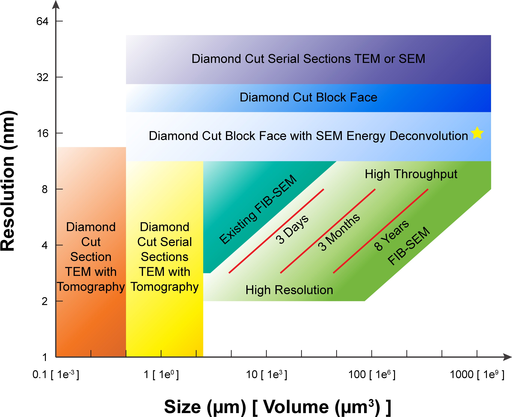

# Background, Brief and Visualization

## Plans

### BRAIN Initiative

Brain Research through Advancing Innovative Neurotechnologies (BRAIN) Initiative

The BRAIN microconnectivity project: Working toward a wiring diagram of an entire mammalian brain. A workshop series co-hosted by the NIH BRAIN Initiative and Department of Energy Office of Science (https://brainconnectivityseries.com) explored the current state of the art, challenges, and opportunities in creating whole mammalian brain microconnectivity maps; a summary of the workshops can be found at https://doi.org/10.2172/1812309.

### STI 2030-Major Projects

Science and Technology Innovation 2030 Major Program (Brain Science and Brain-inspired Research)

This project will focus on non-human primate full-brain meso-connectome; a commentary can be found at https://doi.org/10.1016/j.cell.2022.05.011.

## Species

* Barsotti $\textit{et al}$. [Neural architectures in the light of comparative connectomics](https://doi.org/10.1016/j.conb.2021.10.006)

**Phylogenetic tree of possible candidate reference species for comparative connectomics plus a few others for reference such as humans.** See also the table: list of brain volumes and estimated imaging time with GridTape TEM, with 151 being the number of days necessary to acquire a volume of $1\times 0.5\times 0.5 mm^3$. Asterisk, volumes that can be acquired in less than or up to about a year of 24/7 imaging.

## Microscopy

* Briggman $\textit{and}$ Bock. [Volume Electron Microscopy for Neuronal Circuit Reconstruction](https://doi.org/10.1016/j.conb.2011.10.022). 2011

* Helmstaedter. [Cellular-resolution Connectomics: Challenges of Dense Neural Circuit Reconstruction](https://doi.org/10.1038/nmeth.2476). 2013

**Volume electron microscopy techniques for cellular connectomics and their spatial resolution and scope.** (2a–2d) Sketches of the four most widely used methods for dense-circuit reconstruction: conventional manual ultrathin sectioning of neuropil (2a) followed by TEM or TEMCA imaging (2a), ATUM-SEM (2b), SBEM (2c) and FIB-SEM (2d). In 2a,2b, tissue is first sectioned and then (potentially later) transferred into the electron microscope for imaging. In 2c,2d, the tissue block is abraded while imaging inside the electron microscope. (2e) Approximate minimal resolution and smallest spatial dimension typically attainable with the imaging techniques in 2a–2d, based on published results (gray shading); dashed lines indicate likely future extensions. Values also depend on the quality of staining and neurons of interest in a circuit. Approximate minimal resolution and minimal circuit dimension required to image indicated circuits. C. elegans w.b., C. elegans whole-brain reconstruction; solid line indicates longest series from one worm and dashed line, the combined series length from three worms. D.m. m.b., Drosophila melanogaster mushroom body; minimal required resolution based on estimate of smallest dendrites (30 nm diameter); D.m. medulla, D. melanogaster medulla, 1 cartridge (diameter of ~6 μm) with smallest processes less than 15 nm diameter. Human cortex, minimal circuit volume containing entire L5 pyramidal neuron dendrites and their local axons. Mouse cortex S1 layer 2/3, minimal circuit volume (1d). *, mouse cortex S1 layer 4 minimal circuit volume (1c). M.o.b.glom., mouse olfactory bulb, 1 glomerulus, only intraglomerular circuitry (1e). M. retina s.f., mouse retina, small field (1b). M.ret. w.f., mouse retina, wide field (including the largest amacrine and ganglion cells). Z.f. larv. w.b.: zebrafish larva whole brain.

* Xu $\textit{et al}$. [Enhanced FIB-SEM Systems for Large-volume 3D Imaging](https://doi.org/10.7554/eLife.25916). 2017

**A comparison of various 3D imaging technologies in the application space defined by resolution and total volume.** The resolution value indicated by the bottom boundary for each technology regime represents the minimal isotropic voxel it can achieve, while the size value indicated by the right boundary is the corresponding limit in total volume. An expansion in total volume and improvement in resolution of FIB-SEM would fulfill a desired space at the lower right corner, not yet accessible with any existing technology. The three red diagonal constant imaging time contours indicate the general trade-off between resolution and total volume during FIB-SEM operations of 3 days, 3 months, and 8 years, respectively, using a single FIB-SEM system. These contours are sensitive to staining quality and contrast. The yellow star indicates the intercept between the extrapolated 8-year contour and 1 $mm^3$ volume.

### SEM

* ATUM-SEM
* ATUM-mSEM
* SEF-SEM
* FIB-SEM
* Enhanced FIB-SEM
* GCIB-SEM

### TEM

* ssTEM
* TEMCA
* autoTEM

### ET

* sET
* ssET

## Size and Resolution

* Hess. (PSW 2417) [Super Resolution and 3-D Imaging](https://www.youtube.com/watch?v=tlvrkCZLagg)

* Motta $\textit{et al}$. [Big Data in Nanoscale Connectomics, and the Greed for Training Labels](https://doi.org/10.1016/j.conb.2019.03.012)

**Data rates and information content in connectomics and other scientific methods.** (a) Overview of raw data acquisition rates (black crosses) and total data amounts (blue) for connectomic and other techniques. Human eye: estimate based on 1.2 million ganglion cells per eye, 1 B/s per ganglion cell axon, and 70 years median life time at 16 waking hours per day. (b) Relation between eventual data compressibility and time to achieve the required analysis for various big-data producing methods. Note that 3D EM techniques for connectomics in large (mammalian) brains stand out because of the enormous analysis times. Inset illustrates why imaging of cells using LSM, while generating higher data rates, is immediately and substantially compressible, which connectomic data are not. Note further that first whole-brain 3D EM connectomic datasets and analyses are available. Scale bars, 10 μm (LSM and SEM, left); 0.5 μm (SEM, right).
