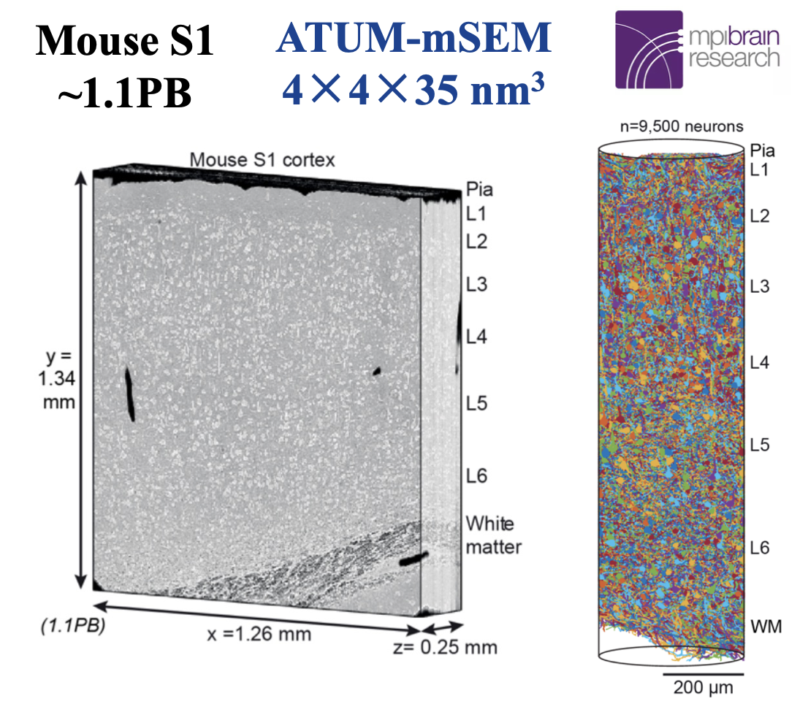
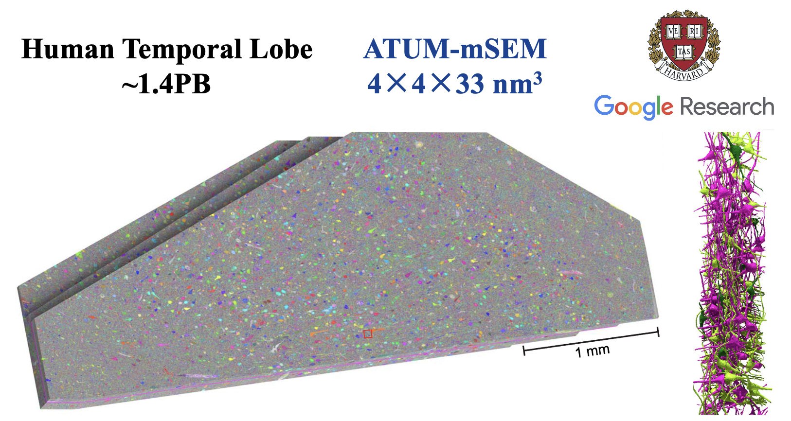
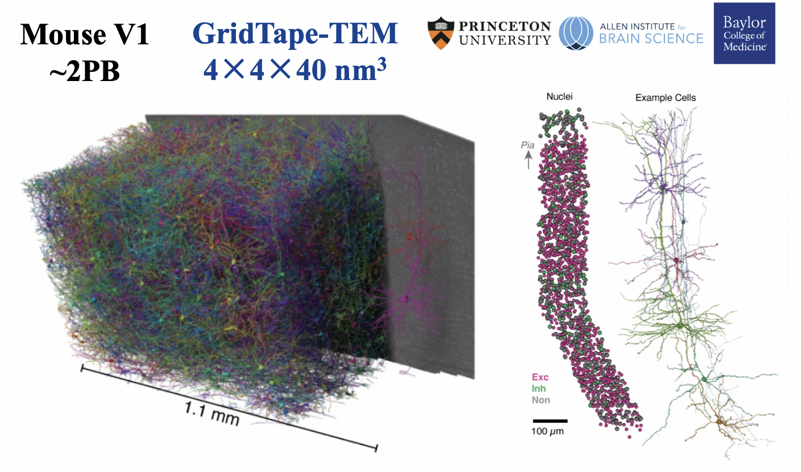

# Awesome vEM Datasets

## Contents

* [Overview of Connectomics](https://github.com/JackieZhai/awesome-em-datasets#overview)
    * Distinguish Connectome
    * Accessible Ground Truth
* [Background](https://github.com/JackieZhai/awesome-em-datasets/blob/master/BACKGROUND.md)
* [Reference](https://github.com/JackieZhai/awesome-em-datasets/blob/master/REFERENCE.md)
* Materials
    * [Open-access Resource](https://github.com/JackieZhai/awesome-em-datasets#open-access-resource)
    * [Related Review](https://github.com/JackieZhai/awesome-em-datasets#related-review)
    * [Related Survey](https://github.com/JackieZhai/awesome-em-datasets#related-survey)
* [Research Group](https://github.com/JackieZhai/awesome-em-datasets/blob/master/GROUP.md)
* [Contribution](https://github.com/JackieZhai/awesome-em-datasets#contribution)

## Overview of Connectomics

*focus synapse-level connectomics datasets generated by the volume electron microscopy*

### Petascale Connectome

| **Year** | **Name**                 | **Size** | **Link** |
|:--------:|:------------------------:|:--------:|:---------|
|   2024   | Si (*e.g.*, Si150L4)     | ~1.1 PB  | https://wklink.org/7122 |
|   2021   | H01                      | ~1.4 PB  | https://h01-release.storage.googleapis.com/data.html |
|   2021   | MICrONS (mm3) | ~2.0 PB  | https://microns-explorer.org/ |

  
   
  

### Online Challenge

| **Year** | **Name**   | **Conference** | **Link** |
|:--------:|:----------:|:-----------------------:|:--------|
|   2024   | NISB       |  Connectomics Conf | https://structuralneurobiologylab.github.io/nisb/# |
|   2013   | SNEMI3D    |   ISBI 2013    | https://snemi3d.grand-challenge.org/ |
|   2016   | CREMI      |  MICCAI 2016   | https://cremi.org/ |
|   2012   | ISBI       |   ISBI 2012    | https://imagej.net/events/isbi-2012-segmentation-challenge |

### Distinguish Connectome

| **Full set** | **Subset**              | **Connectome**                             | **Link** |
|:------------:|:-----------------------:|:------------------------------------------:|:--------:|
| FAFB         | CREMI-A/B/C             | FlyWire                                    |   |
| Kasthuri15   | SNEMI3D/AC3/AC4         | two cylinders |   |
| Hemi-brain   | Hemi-brain training set |                                            |   |
| FIB-25       | FIB-25 training set     |                                            |   |
| J0126        | J0126 training set      |                                            |   |

*TODO: Other Accessible Ground Truth*

### Accessible Ground Truth

<table>
    <tr>
        <th>Name <i>for short</i></th>
        <th>Size <i>μm3</i></th>
        <th>Resolution <i>nm3</i></th>
        <th>GT Size <i>μm3</i></th>
        <th>GT Resolution <i>nm3</i></th>
        <th>GT Size <i>voxel</i></th>
        <th>Link</th>
        <th>&nbsp;&nbsp;&nbsp;&nbsp;&nbsp;&nbsp;&nbsp;&nbsp;&nbsp;&nbsp;&nbsp;&nbsp;&nbsp;&nbsp;&nbsp;&nbsp;&nbsp;&nbsp;Note&nbsp;&nbsp;&nbsp;&nbsp;&nbsp;&nbsp;&nbsp;&nbsp;&nbsp;&nbsp;&nbsp;&nbsp;&nbsp;&nbsp;&nbsp;&nbsp;&nbsp;&nbsp;</th>
    </tr>
    <tr>
        <td rowspan="2">AxonEM</td>
        <td rowspan="2">30x30x30</td>
        <td>7x7x40</td>
        <td rowspan="2"></td>
        <td>7x7x40</td>
        <td rowspan="2"></td>
        <td rowspan="2"><a href="https://axonem.grand-challenge.org/">grand-challenge</a></td>
        <td rowspan="2">subsets of MICrONS and H01</td>
    </tr>
    <tr>
        <td>8x8x30</td>
        <td>8x8x30</td>
    </tr>
    <tr>
        <td>H01</td>
        <td>2,000x3,000x175</td>
        <td>4x4x30</td>
        <td></td>
        <td>8x8x30</td>
        <td></td>
        <td><a href="https://h01-release.storage.googleapis.com/landing.html">google</a></td>
        <td></td>
    </tr>
</table>

*TODO: Other Accessible Ground Truth*

## Open-access Resource

* [Open Connectome Project](https://neurodata.io/project/ocp/)
* [BossDB](https://bossdb.org/projects)
* [EMPIAR](https://www.ebi.ac.uk/empiar/)
* [Zenodo](https://zenodo.org/)
* [webKnossos](https://webknossos.org/publications)
* [Neuroglancer](https://github.com/google/neuroglancer)

## Related Review

* Kornfeld <i>and</i> Denk. [Progress and Remaining Challenges in High-throughput Volume Electron Microscopy](https://doi.org/10.1016/j.conb.2018.04.030). 2018
* Kievits <i>et al.</i> [How Innovations in Methodology Offer New Prospects for Volume Electron Microscopy](https://doi.org/10.1111/jmi.13134). 2022
* Beyer <i>et al.</i> [A Survey of Visualization and Analysis in High-Resolution Connectomics](https://doi.org/10.1111/cgf.14574). 2022
* Jefferis <i>et al.</i> [Scaling up Connectomics: The Road to a Whole Mouse Brain Connectome](https://wellcome.org/reports/scaling-connectomics). 2023

## Related Survey

* [connectomics-vis-survey.github.io](https://connectomics-vis-survey.github.io/)
* [braincircuits.io/resources](https://braincircuits.io/resources)
* [tianyan.gitlab.io/braindata/connectomics-survey](https://tianyan.gitlab.io/braindata/connectomics-survey/)
* [github.com/subeeshvasu/Awesome-Neuron-Segmentation-in-EM-Images](https://github.com/subeeshvasu/Awesome-Neuron-Segmentation-in-EM-Images)
* [github.com/Levishery/connectomic-paper-datasets](https://github.com/Levishery/connectomic-paper-datasets)

## Related Code

* [Local Shape Descriptors](https://github.com/funkelab/lsd)
* [PyTorch Connectomics](https://connectomics.readthedocs.io/en/latest/tutorials/neuron.html)

## Contribution

(including the private communication)
* [Hao Zhai](https://github.com/JackieZhai)
* [Liuyun Jiang](https://github.com/WillieBigHead)
* Xinghui Zhao
* [Yanchao Zhang](https://github.com/Cristand)
* [Jinyue Guo](https://github.com/fenglingbai)

Please [**contribute**](https://github.com/JackieZhai/awesome-em-datasets/blob/master/CONTRIBUTING.md) [Pull Request](https://github.com/JackieZhai/awesome-em-datasets/pulls) & [Issue](https://github.com/JackieZhai/awesome-em-datasets/issues) if you think a new dataset or a relevant paper is missing.

Let's enjoy the beauty of EM data and the awesome micro-connectomes!
