# Awesome EM Datasets

### Contents

* [Overview](https://github.com/JackieZhai/awesome-em-datasets#overview)
* [Species](https://github.com/JackieZhai/awesome-em-datasets#species)
* [Microscopy](https://github.com/JackieZhai/awesome-em-datasets#microscopy)
* [Size and Resolution](https://github.com/JackieZhai/awesome-em-datasets#size-and-resolution)
* [Reference](https://github.com/JackieZhai/awesome-em-datasets#reference)
* [Related Work](https://github.com/JackieZhai/awesome-em-datasets#related-work)
* [Acknowledgment](https://github.com/JackieZhai/awesome-em-datasets#acknowledgement)
* [Contribution](https://github.com/JackieZhai/awesome-em-datasets#contribution)

## Overview

<table>
    <tr>
        <th>Name $\textit{for short}$</th>
        <th>Species</th>
        <th>&nbsp;&nbsp;&nbsp;&nbsp;&nbsp;&nbsp;Sample&nbsp;&nbsp;&nbsp;&nbsp;&nbsp;&nbsp;</th>
        <th>&nbsp;&nbsp;&nbsp;&nbsp;Microscopy&nbsp;&nbsp;&nbsp;&nbsp;</th>
        <th>Size $\mu m^{3}$</th>
        <th>Resolution $nm^{3}$</th>
        <th>&nbsp;&nbsp;&nbsp;&nbsp;&nbsp;&nbsp;&nbsp;&nbsp;Number&nbsp;&nbsp;&nbsp;&nbsp;&nbsp;&nbsp;&nbsp;&nbsp;</th>
        <th>Link</th>
        <th>&nbsp;&nbsp;&nbsp;&nbsp;&nbsp;&nbsp;&nbsp;&nbsp;&nbsp;&nbsp;&nbsp;Reference&nbsp;&nbsp;&nbsp;&nbsp;&nbsp;&nbsp;&nbsp;&nbsp;&nbsp;&nbsp;&nbsp;</th>
        <th>&nbsp;&nbsp;&nbsp;&nbsp;&nbsp;&nbsp;&nbsp;&nbsp;&nbsp;&nbsp;&nbsp;&nbsp;&nbsp;&nbsp;&nbsp;&nbsp;&nbsp;&nbsp;Note&nbsp;&nbsp;&nbsp;&nbsp;&nbsp;&nbsp;&nbsp;&nbsp;&nbsp;&nbsp;&nbsp;&nbsp;&nbsp;&nbsp;&nbsp;&nbsp;&nbsp;&nbsp;</th>
    </tr>
    <tr>
        <td rowspan="2">AxonEM</td>
        <td>mouse</td>
        <td>primary visual cortex</td>
        <td>ssTEM</td>
        <td rowspan="2">$30\times 30\times 30$</td>
        <td>$7\times 7\times 40$</td>
        <td rowspan="2">18,000 axons</td>
        <td rowspan="2"><a href="https://axonem.grand-challenge.org/">grand-challenge</a></td>
        <td rowspan="2">Wei $\textit{et al}$., <a href="https://github.com/JackieZhai/awesome-em-datasets#2021">2021</a></td>
        <td rowspan="2">subsets of MICrONS and H01</td>
    </tr>
    <tr>
        <td>human</td>
        <td>temporal cortex</td>
        <td>ATUM-mSEM</td>
        <td>$8\times 8\times 30$</td>
    </tr>
    <tr>
        <td>H01</td>
        <td>human</td>
        <td>temporal lobe</td>
        <td>ATUM-mSEM</td>
        <td>$2,000\times 3,000\times 175$</td>
        <td>$4\times 4\times 30$</td>
        <td>50,000 cells   133,700,000 synapses</td>
        <td><a href="https://h01-release.storage.googleapis.com/landing.html">google</a></td>
        <td>Shapson-Coe $\textit{et al}$., <a href="https://github.com/JackieZhai/awesome-em-datasets#2021">2021</a></td>
        <td></td>
    </tr>
    <tr>
        <td>J0126</td>
        <td>finch</td>
        <td>area X</td>
        <td>SBF-SEM</td>
        <td>$96\times 98\times 114$</td>
        <td>$9\times 9\times 20$</td>
        <td>33 blocks 12+50 skels</td>
        <td><a href="https://storage.googleapis.com/j0126-nature-methods-data/GgwKmcKgrcoNxJccKuGIzRnQqfit9hnfK1ctZzNbnuU/rawdata_realigned">cloudvolume-raw</a> <a href="https://storage.googleapis.com/j0126-nature-methods-data/GgwKmcKgrcoNxJccKuGIzRnQqfit9hnfK1ctZzNbnuU/ffn_segmentation">cloudvolume-seg</a>
        </td>
        <td>Januszewski $\textit{et al}$., <a href="https://github.com/JackieZhai/awesome-em-datasets#2018">2018</a></td>
        <td>testing for FFN</td>
    </tr>
    <tr>
        <td>Kasthuri</td>
        <td>mouse</td>
        <td>neocortex</td>
        <td>ATUM-SEM</td>
        <td>$40\times 40\times 50$</td>
        <td>$3\times 3\times 30$</td>
        <td>1,700 synapses</td>
        <td><a href="https://lichtman.rc.fas.harvard.edu/vast/">vast</a></td>
        <td>Kasthuri $\textit{et al}$., <a href="https://github.com/JackieZhai/awesome-em-datasets#2015">2015</a></td>
        <td>superset of SNEMI</td>
    </tr>
    <tr>
        <td>MICrONS Cortical $mm^3$</td>
        <td>mouse</td>
        <td>primary visual cortex and three higher visual areas</td>
        <td>autoTEM</td>
        <td>$1,300\times 870\times 820$</td>
        <td>$4\times 4\times 40$</td>
        <td>200,000 cells 524,000,000 synapses</td>
        <td><a href="https://www.microns-explorer.org/cortical-mm3">microns</a> <a href="https://zenodo.org/record/5760218#.Yrq7y6hBxPY">zenodo</a> <a href="https://bossdb.org/project/microns-minnie">bossdb</a></td>
        <td>MICrONS Consortium $\textit{et al}$., <a href="https://github.com/JackieZhai/awesome-em-datasets#2021">2021</a></td>
        <td></td>
    </tr>
    <tr>
        <td>MICrONS Layer 2/3</td>
        <td>mouse</td>
        <td>primary visual cortex</td>
        <td>ssTEM</td>
        <td>$250\times 140\times 90$</td>
        <td>$3.58\times 3.58\times 40$</td>
        <td>451 neurons (417 PyCs) 169 non-neuronal cells</td>
        <td><a href="https://www.microns-explorer.org/phase1">microns</a></td>
        <td>Turner $\textit{et al}$., <a href="https://github.com/JackieZhai/awesome-em-datasets#2022">2022</a></td>
        <td>pilot dataset of MICrONS Cortical $mm^3$</td>
    </tr>
    <tr>
        <td>ISBI</td>
        <td>fly</td>
        <td>ventral nerve line</td>
        <td>ssTEM</td>
        <td>$2\times 2\times 1.5$</td>
        <td>$4\times 4\times 50$</td>
        <td></td>
        <td></td>
        <td></td>
        <td>Segmentation of neuronal structures in EM stacks</td>
    </tr>
    <tr>
        <td>SNEMI3D</td>
        <td>mouse</td>
        <td>cortex</td>
        <td>ATUM-SEM</td>
        <td>$6\times 6\times 3$</td>
        <td>$6\times 6\times 30$</td>
        <td></td>
        <td></td>
        <td></td>
        <td>SNEMI3D: 3D Segmentation of neurites in EM images</td>
    </tr>
</table>

* Kornfeld $\textit{and}$ Denk. [Progress and Remaining Challenges in High-throughput Volume Electron Microscopy](https://doi.org/10.1016/j.conb.2018.04.030). 2018
* Kievits $\textit{et al}$. [How Innovations in Methodology Offer New Prospects for Volume Electron Microscopy](https://doi.org/10.1111/jmi.13134). 2022
* Beyer $\textit{et al}$. [A Survey of Visualization and Analysis in High-Resolution Connectomics](https://doi.org/10.1111/cgf.14574). 2022

## Species

* Barsotti $\textit{et al}$. [Neural architectures in the light of comparative connectomics](https://doi.org/10.1016/j.conb.2021.10.006)

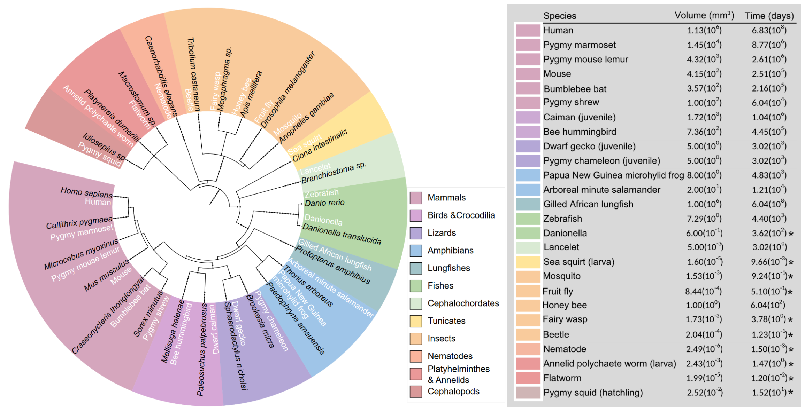

**Phylogenetic tree of possible candidate reference species for comparative connectomics plus a few others for reference such as humans.** See also the table: list of brain volumes and estimated imaging time with GridTape TEM, with 151 being the number of days necessary to acquire a volume of $1\times 0.5\times 0.5 mm^3$. Asterisk, volumes that can be acquired in less than or up to about a year of 24/7 imaging.

## Microscopy

* Briggman $\textit{and}$ Bock. [Volume Electron Microscopy for Neuronal Circuit Reconstruction](https://doi.org/10.1016/j.conb.2011.10.022). 2011

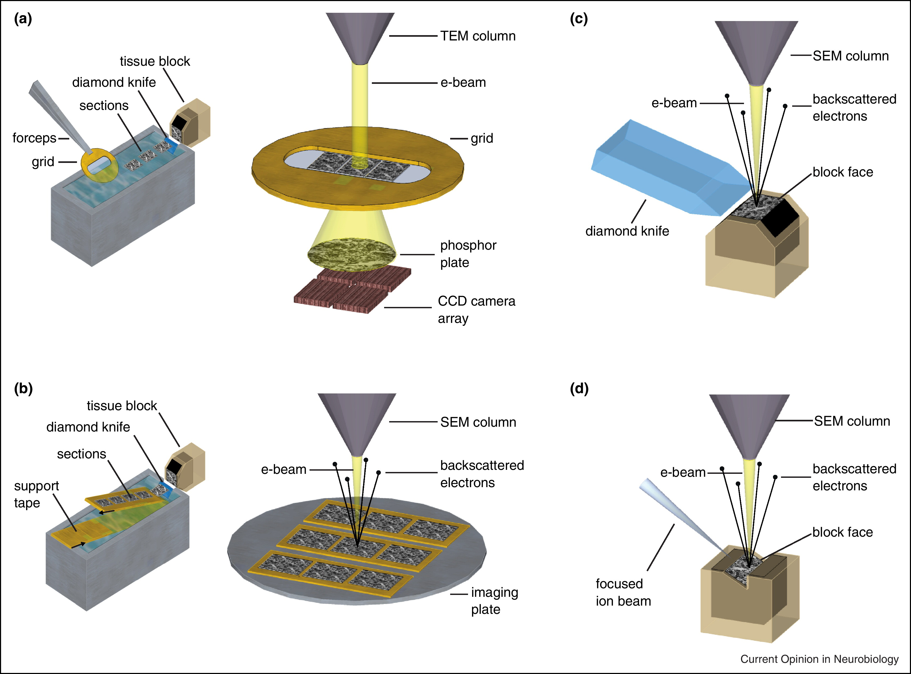

* Helmstaedter. [Cellular-resolution Connectomics: Challenges of Dense Neural Circuit Reconstruction](https://doi.org/10.1038/nmeth.2476). 2013

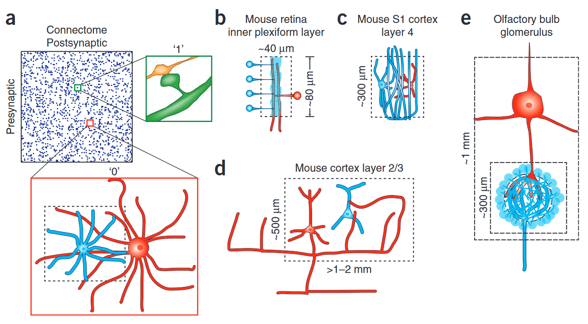

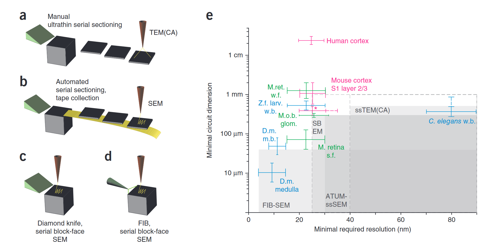

**Volume electron microscopy techniques for cellular connectomics and their spatial resolution and scope.** (2a–2d) Sketches of the four most widely used methods for dense-circuit reconstruction: conventional manual ultrathin sectioning of neuropil (2a) followed by TEM or TEMCA imaging (2a), ATUM-SEM (2b), SBEM (2c) and FIB-SEM (2d). In 2a,2b, tissue is first sectioned and then (potentially later) transferred into the electron microscope for imaging. In 2c,2d, the tissue block is abraded while imaging inside the electron microscope. (2e) Approximate minimal resolution and smallest spatial dimension typically attainable with the imaging techniques in 2a–2d, based on published results (gray shading); dashed lines indicate likely future extensions. Values also depend on the quality of staining and neurons of interest in a circuit. Approximate minimal resolution and minimal circuit dimension required to image indicated circuits. C. elegans w.b., C. elegans whole-brain reconstruction; solid line indicates longest series from one worm and dashed line, the combined series length from three worms. D.m. m.b., Drosophila melanogaster mushroom body; minimal required resolution based on estimate of smallest dendrites (30 nm diameter); D.m. medulla, D. melanogaster medulla, 1 cartridge (diameter of ~6 μm) with smallest processes less than 15 nm diameter. Human cortex, minimal circuit volume containing entire L5 pyramidal neuron dendrites and their local axons. Mouse cortex S1 layer 2/3, minimal circuit volume (1d). *, mouse cortex S1 layer 4 minimal circuit volume (1c). M.o.b.glom., mouse olfactory bulb, 1 glomerulus, only intraglomerular circuitry (1e). M. retina s.f., mouse retina, small field (1b). M.ret. w.f., mouse retina, wide field (including the largest amacrine and ganglion cells). Z.f. larv. w.b.: zebrafish larva whole brain.

* Xu $\textit{et al}$. [Enhanced FIB-SEM Systems for Large-volume 3D Imaging](https://doi.org/10.7554/eLife.25916). 2017

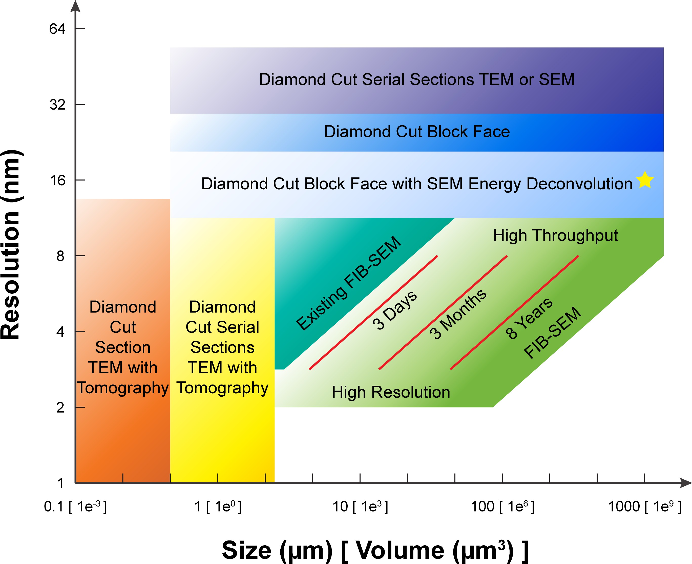

**A comparison of various 3D imaging technologies in the application space defined by resolution and total volume.** The resolution value indicated by the bottom boundary for each technology regime represents the minimal isotropic voxel it can achieve, while the size value indicated by the right boundary is the corresponding limit in total volume. An expansion in total volume and improvement in resolution of FIB-SEM would fulfill a desired space at the lower right corner, not yet accessible with any existing technology. The three red diagonal constant imaging time contours indicate the general trade-off between resolution and total volume during FIB-SEM operations of 3 days, 3 months, and 8 years, respectively, using a single FIB-SEM system. These contours are sensitive to staining quality and contrast. The yellow star indicates the intercept between the extrapolated 8-year contour and 1 $mm^3$ volume.

### SEM

* ATUM-SEM
* ATUM-mSEM
* SEF-SEM
* FIB-SEM
* Enhanced FIB-SEM
* GCIB-SEM

### TEM

* ssTEM
* TEMCA
* autoTEM

### ET

* sET
* ssET

## Size and Resolution

* Hess. (PSW 2417) [Super Resolution and 3-D Imaging](https://www.youtube.com/watch?v=tlvrkCZLagg)

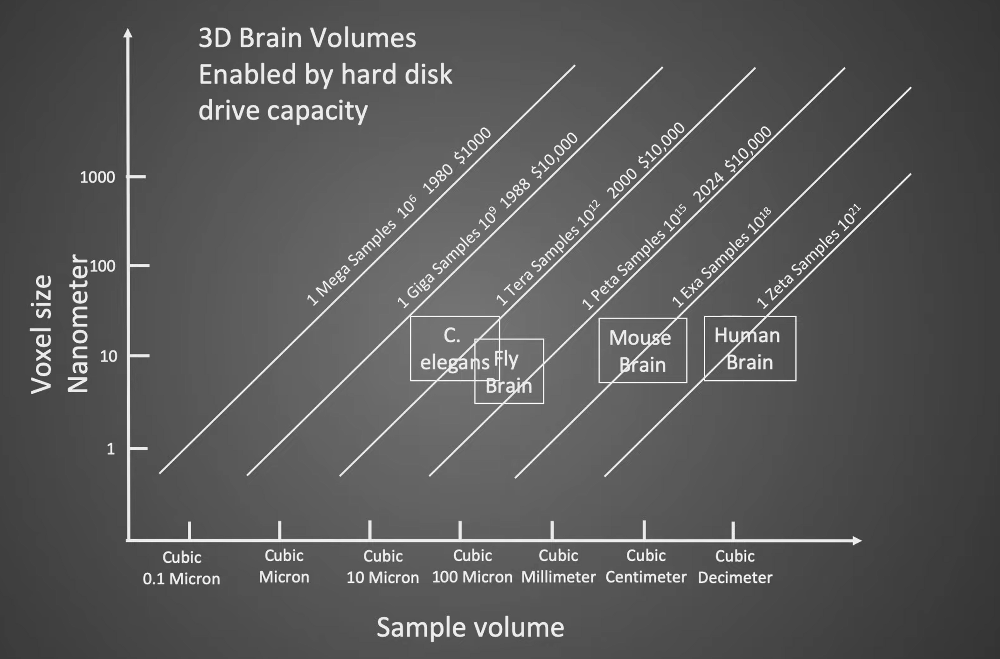

* Motta $\textit{et al}$. [Big Data in Nanoscale Connectomics, and the Greed for Training Labels](https://doi.org/10.1016/j.conb.2019.03.012)

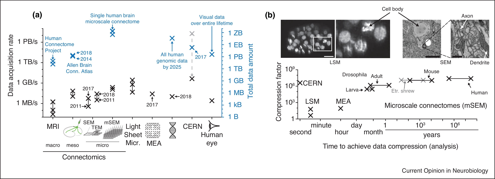

**Data rates and information content in connectomics and other scientific methods.** (a) Overview of raw data acquisition rates (black crosses) and total data amounts (blue) for connectomic and other techniques. Human eye: estimate based on 1.2 million ganglion cells per eye, 1 B/s per ganglion cell axon, and 70 years median life time at 16 waking hours per day. (b) Relation between eventual data compressibility and time to achieve the required analysis for various big-data producing methods. Note that 3D EM techniques for connectomics in large (mammalian) brains stand out because of the enormous analysis times. Inset illustrates why imaging of cells using LSM, while generating higher data rates, is immediately and substantially compressible, which connectomic data are not. Note further that first whole-brain 3D EM connectomic datasets and analyses are available. Scale bars, 10 μm (LSM and SEM, left); 0.5 μm (SEM, right).

## Reference

### 2022

* Turner $\textit{et al}$. [Reconstruction of Neocortex: Organelles, Compartments, Cells, Circuits, and Activity](https://doi.org/10.1016/j.cell.2022.01.023)

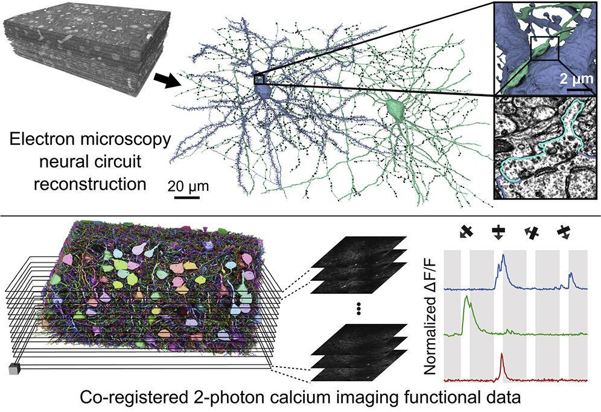

### 2021

* Wei $\textit{et al}$. [AxonEM Dataset: 3D Axon Instance Segmentation of Brain Cortical Regions](https://doi.org/10.1007/978-3-030-87193-2_17)

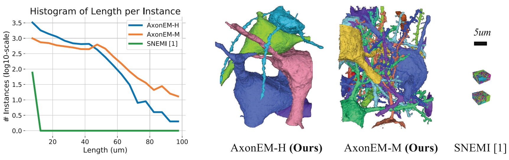

* Shapson-Coe $\textit{et al}$. [A Connectomic Study of a Petascale Fragment of Human Cerebral Cortex](https://www.biorxiv.org/content/10.1101/2021.05.29.446289v4)

* MICrONS Consortium $\textit{et al}$. [Functional Connectomics Spanning Multiple Areas of Mouse Visual Cortex](https://www.biorxiv.org/content/10.1101/2021.07.28.454025v2)

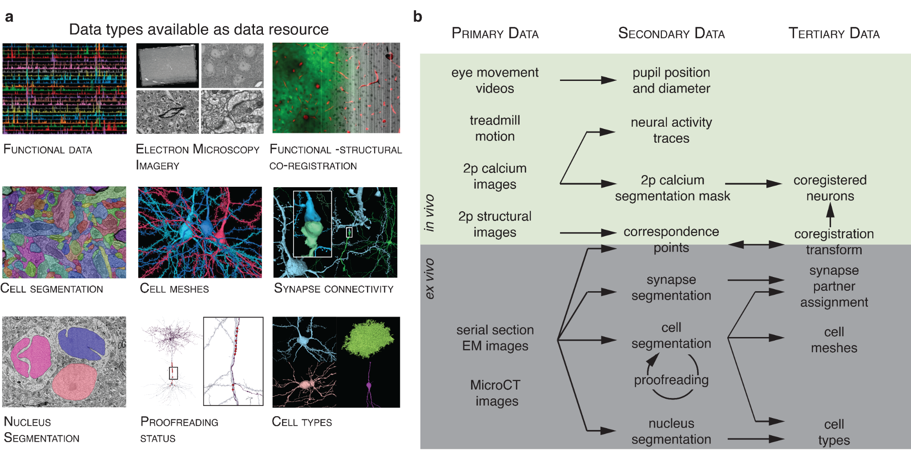

* Lin $\textit{et al}$. [NucMM Dataset: 3D Neuronal Nuclei Instance Segmentation at Sub-Cubic Millimeter Scale](https://doi.org/10.1007/978-3-030-87193-2_16)

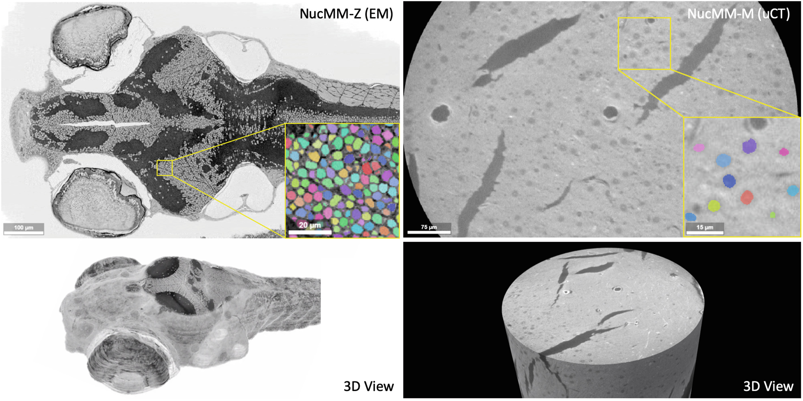

### 2020

* Wei $\textit{et al}$. [MitoEM Dataset: Large-Scale 3D Mitochondria Instance Segmentation from EM Images](https://doi.org/10.1007/978-3-030-59722-1_7)

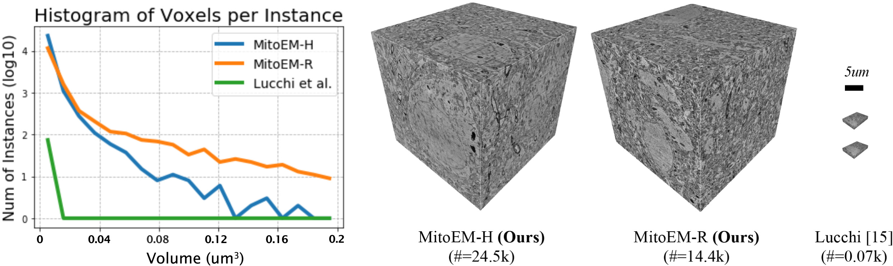

* Scheffer $\textit{et al}$. [A connectome and analysis of the adult Drosophila central brain](https://doi.org/10.7554/eLife.57443)

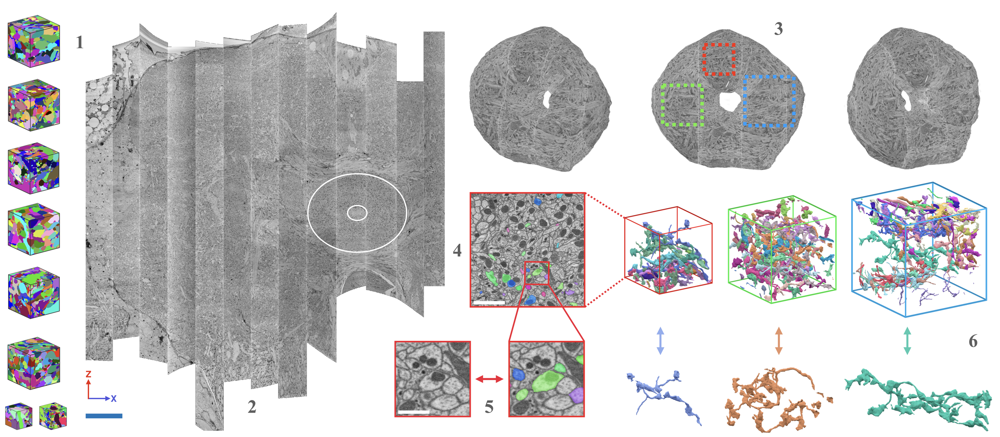

### 2019
### 2018

* Januszewski $\textit{et al}$. [High-precision automated reconstruction of neurons with flood-filling networks](https://doi.org/10.1038/s41592-018-0049-4)

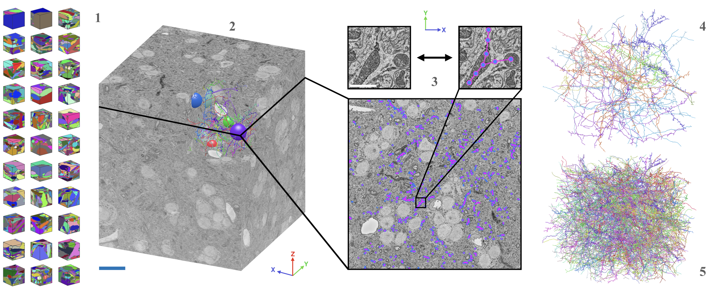

### 2017
### 2016
### 2015

* Takemura $\textit{et al}$. [Synaptic circuits and their variations within different columns in the visual system of Drosophila](https://doi.org/10.1073/pnas.1509820112)

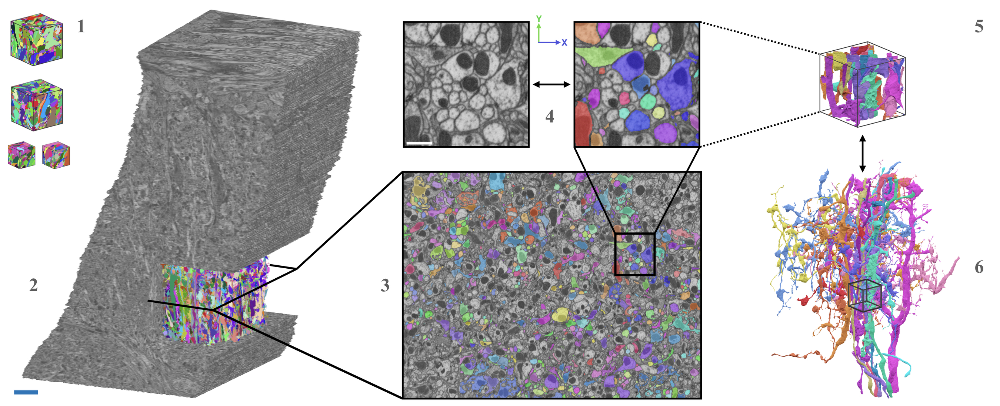

* Kasthuri $\textit{et al}$. [Saturated Reconstruction of a Volume of Neocortex](https://doi.org/10.1016/j.cell.2015.06.054)

### 2014
### 2013

## Related Work

* [Open Connectome Project](https://neurodata.io/project/ocp/)
* [webKnossos](https://webknossos.org/publications)
* [NeuroMorpho.Org](https://neuromorpho.org/index.jsp)
* [EMPIAR](https://www.ebi.ac.uk/empiar/)

## Acknowledgement

* **Lichtman** Lab, Department of Molecular and Cellular Biology, Center for Brain Science, Harvard University
* **Seung** Lab, Computer Science Department, Princeton Neuroscience Institute
* **Helmstaedter** Lab, Department of Connectomics, Max Planck Institute for Brain Research
* **Pfister** Lab, Visual Computing Group, School of Engineering and Applied Sciences, Harvard University
* **Funke** Lab, Janelia Research Campus, Howard Hughes Medical Institute

Social preview background image was taken from [PyGame](https://twitter.com/PyrGame/status/1544863064100683781).

## Contribution

* [Hao Zhai](https://github.com/JackieZhai)

Please [**contribute**](https://github.com/JackieZhai/awesome-em-datasets/pulls) if you think a new dataset or a relevant paper is missing.

Let's enjoy the beauty of EM data and micro-connectomes!
