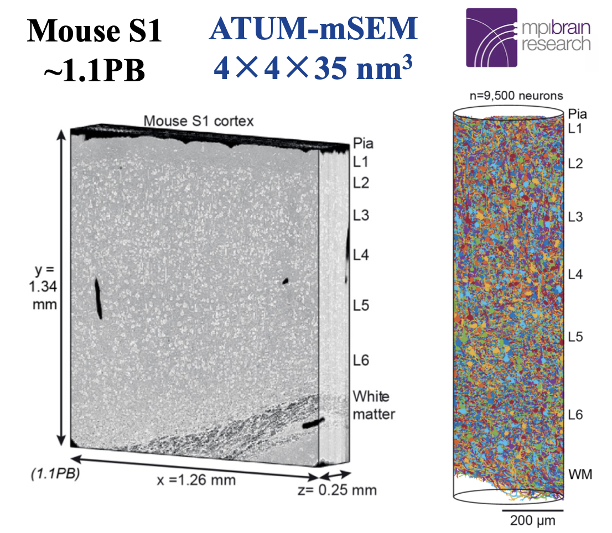
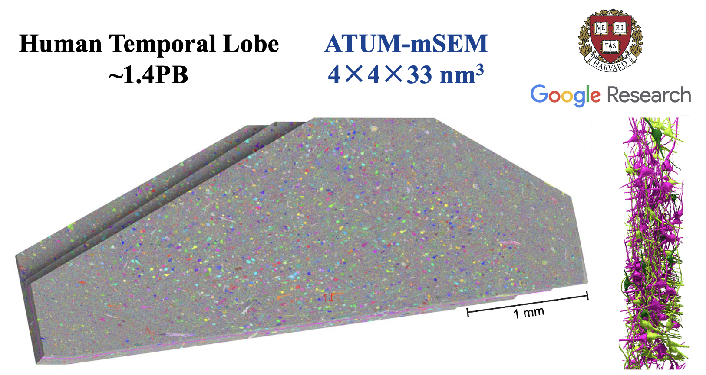
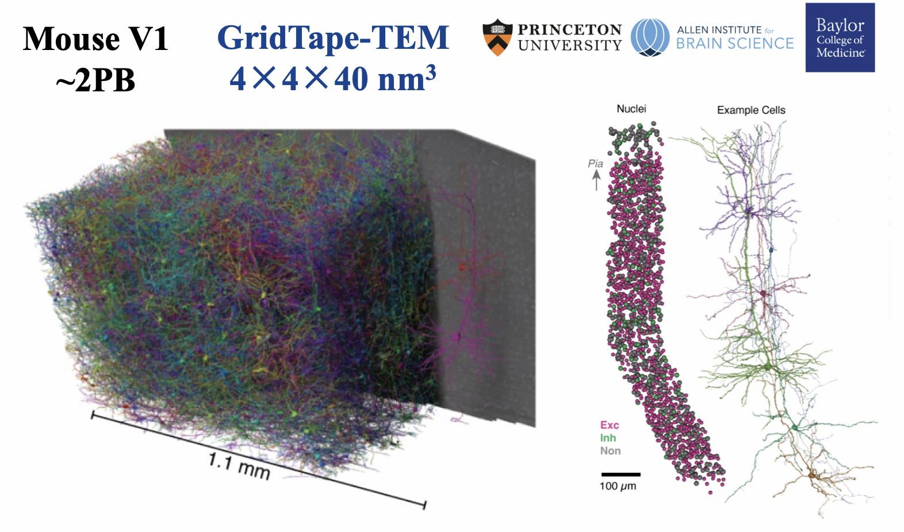

# Awesome vEM Datasets

A curated list of **volume electron microscopy (vEM)** datasets, from benchmark cubes to whole-brain and petascale connectomes, with the ground truth, portals, tools and literature needed to use them.

> **Volume EM in one paragraph.** vEM images a resin-embedded, heavy-metal-stained specimen as a stack of thousands of serial electron micrographs, either by repeatedly imaging and shaving the block face (SBEM, FIB-SEM) or by imaging ultrathin serial sections (ssTEM, ATUM-SEM, multibeam SEM, GridTape TEM). The result is a 3D image with nanometre voxels (typically 3&ndash;20 nm in-plane and 4&ndash;50 nm between slices) in which every membrane, organelle and chemical synapse is visible. That makes vEM the reference method for **synaptic-resolution connectomics**, the complete wiring diagrams of nervous systems, and a key tool for cell biology. Recognition has followed the scale: *Nature* listed vEM among its [technologies to watch in 2023](https://doi.org/10.1038/d41586-023-00178-y), and *Nature Methods* named [EM-based connectomics its Method of the Year 2025](https://doi.org/10.1038/s41592-025-02988-6). Datasets now range from ~10 μm cubes to the whole adult *Drosophila* central nervous system, whole larval zebrafish brains and cubic millimetres of mouse and human cortex (> 1 PB each). Reconstruction rather than imaging is the bottleneck, which is why the ground truth collected here matters. The [primer](BACKGROUND.md) covers techniques, sample preparation, the reconstruction pipeline and data infrastructure.

## Contents

* [Landmark Connectomes](#landmark-connectomes)
* [Petascale Volumes](#petascale-volumes)
* [Benchmarks and Challenges](#benchmarks-and-challenges)
* [From Volume to Benchmark to Connectome](#from-volume-to-benchmark-to-connectome)
* [Accessible Ground Truth](#accessible-ground-truth)
* [Pre-training Corpora](#pre-training-corpora)
* [Data Portals and Tools](#data-portals-and-tools)
* [Reviews](#reviews)
* [Related Lists and Surveys](#related-lists-and-surveys)
* [Related Code](#related-code)
* [Contribution](#contribution)

| **Page** | **What is inside** |
|:--|:--|
| [Background](BACKGROUND.md) | primer on vEM: techniques, sample preparation, from images to connectomes, data scale, programs, figures |
| [Museum of Datasets](DATASET.md) | every dataset by organism (benchmark cubes, nematodes, insects, other invertebrates, fish, birds, rodents, primates, cell biology) with species, sample, microscopy, size, resolution and links |
| [Reference](REFERENCE.md) | the papers behind the datasets, by year, with figures |
| [Research Group](GROUP.md) | labs and companies that produce vEM datasets and tools |
| [Contributing](CONTRIBUTING.md) | how to add or correct an entry |

## Landmark Connectomes

*Complete nervous systems (or brains) and the largest mammalian volumes reconstructed at synaptic resolution; newest first. Details and many more datasets are in the [museum](DATASET.md).*

| **Year** | **Organism** | **Dataset** | **Microscopy** | **Scale** | **Data** |
|:--------:|:-------------|:------------|:---------------|:----------|:---------|
| 2026 | *Drosophila*, adult male CNS (brain + VNC) | [Male CNS](DATASET.md#insects) | FIB-SEM | ~166,700 neurons | [male-cns](https://male-cns.janelia.org/) |
| 2026 | *Drosophila*, adult female brain + VNC | [BANC](DATASET.md#insects) | ssTEM (GridTape) | brain and nerve cord of one animal | [bossdb](https://bossdb.org/project/bates_phelps_kim_yang2025) |
| 2025 | Mouse, visual cortex (~1 mm3) | [MICrONS](DATASET.md#mouse-and-other-rodents) | autoTEM | ~200,000 cells, 524 M synapses | [microns-explorer](https://www.microns-explorer.org/cortical-mm3) |
| 2025 | *Platynereis* larva, whole body | [Platynereis](DATASET.md#other-invertebrates-and-chordates) | ssTEM | &gt;9,000 cells | [catmaid](https://catmaid.jekelylab.ex.ac.uk) |
| 2025 | Zebrafish larva, brain + spinal cord | [Fish1](DATASET.md#fish) | &ndash; | ~187,000 cells, ~30 M synapses (preprint) | [fish1](https://fish1-release.storage.googleapis.com/index.html) |
| 2025 | Zebrafish larva, whole brain | [Whole Brain (ION-CAS)](DATASET.md#fish) | ssSEM | ~177,000 cells, ~25 M synapses (preprint) | &ndash; |
| 2025 | *Drosophila*, adult optic lobe | [Optic Lobe](DATASET.md#insects) | FIB-SEM | ~53,000 neurons | [neuprint](https://neuprint.janelia.org/) |
| 2024 | *Drosophila*, adult female brain | [FAFB / FlyWire](DATASET.md#insects) | ssTEM (TEMCA2) | 139,255 neurons, 54.5 M synapses | [codex](https://codex.flywire.ai/) |
| 2024 | *Drosophila*, adult male VNC | [MANC](DATASET.md#insects) | FIB-SEM | ~23,000 neurons | [neuprint](https://neuprint.janelia.org/) |
| 2024 | *Drosophila*, adult female VNC | [FANC](DATASET.md#insects) | ssTEM (GridTape) | ~14,600 neuronal cell bodies | [bossdb](https://bossdb.org/project/phelps_hildebrand_graham2021) |
| 2024 | Human temporal cortex (~1 mm3) | [H01](DATASET.md#primates-and-human) | ATUM-mSEM | 1.4 PB, 104 proofread neurons | [h01-release](https://h01-release.storage.googleapis.com/landing.html) |
| 2023 | *Drosophila* larva, brain | [L1EM](DATASET.md#insects) | ssTEM | 3,016 neurons, 548,000 synapses | [catmaid](https://l1em.catmaid.virtualflybrain.org/) |
| 2021 | *C. elegans*, birth to adulthood | [Witvliet2020](DATASET.md#nematodes) | ssTEM | 8 brains | [nemanode](https://nemanode.org/) |
| 2020 | *Drosophila*, adult central brain | [Hemi-brain](DATASET.md#insects) | FIB-SEM | ~25,000 neurons | [neuprint](https://neuprint.janelia.org/) |
| 2019 | *C. elegans*, both sexes | [WormWiring](DATASET.md#nematodes) | ssTEM | 302 / 385 neurons | [wormwiring](https://wormwiring.org/) |
| 2016 | *Ciona* larva, CNS | [Ciona Larva](DATASET.md#other-invertebrates-and-chordates) | ssTEM | 177 neurons | &ndash; |
| 1986 | *C. elegans* hermaphrodite | [MoW](DATASET.md#nematodes) | ssTEM | 302 neurons | [wormatlas](https://www.wormatlas.org) |

*In progress:* the BRAIN CONNECTS mouse hippocampal formation (~10 mm3, multibeam SEM) and [Fish Fire&Wire](https://www.janelia.org/fish-firewire) (whole-brain activity + EM of the same larval zebrafish); see [Programs and Initiatives](BACKGROUND.md#programs-and-initiatives).

## Petascale Volumes

| **Year** | **Name**                 | **Size** | **Link** |
|:--------:|:------------------------:|:--------:|:---------|
|   2024   | Si (*e.g.*, Si150L4)     | ~1.1 PB  | https://wklink.org/7122 |
|   2021   | H01                      | ~1.4 PB  | https://h01-release.storage.googleapis.com/data.html |
|   2021   | MICrONS (mm3) | ~2.0 PB  | https://microns-explorer.org/ |

  
  
  

*Rule of thumb:* 1 mm3 at 4&times;4&times;40 nm is ~1.6&times;1015 voxels, i.e. ~1.6 PB of 8-bit raw data.

## Benchmarks and Challenges

| **Year** | **Name** | **Task** | **Data** | **Venue** | **Link** |
|:--------:|:---------|:---------|:---------|:---------:|:---------|
| 2025 | CellMap | 3D semantic + instance segmentation of &gt;40 organelle classes | FIB-SEM of cells and tissues, 4/8 nm | Janelia | https://cellmapchallenge.janelia.org/ |
| 2025 | ConnectomeBench | proofreading with (multimodal) LLMs | MICrONS, FlyWire | NeurIPS 2025 | https://github.com/jffbrwn2/ConnectomeBench |
| 2024 | NISB | neuron instance segmentation | &ndash; | Connectomics Conf | https://structuralneurobiologylab.github.io/nisb/# |
| 2023 | WASPSYN | domain-adaptive synapse detection | micro-wasp FIB-SEM, 8 nm | ISBI 2023 | https://codalab.lisn.upsaclay.fr/competitions/9169 |
| 2023 | XPRESS X-ray, not EM | myelinated-axon segmentation | mouse white matter, XNH 100 nm | ISBI 2023 | https://xpress.grand-challenge.org/ |
| 2021 | MitoEM | mitochondria instance segmentation | rat + human cortex, mSEM | ISBI 2021 | https://mitoem.grand-challenge.org/ |
| 2021 | AxonEM | axon instance segmentation | mouse + human cortex | MICCAI 2021 | https://axonem.grand-challenge.org/ |
| 2021 | NucMM | nucleus instance segmentation | zebrafish (vEM) + mouse (micro-CT) | MICCAI 2021 | https://nucmm.grand-challenge.org/ |
| 2016 | CREMI | neurons, synaptic clefts, synaptic partners | FAFB ssTEM | MICCAI 2016 | https://cremi.org/ |
| 2013 | SNEMI3D | 3D neurite segmentation | Kasthuri15 ATUM-SEM | ISBI 2013 | https://snemi3d.grand-challenge.org/ |
| 2012 | ISBI | 2D membrane segmentation | *Drosophila* VNC ssTEM | ISBI 2012 | https://imagej.net/events/isbi-2012-segmentation-challenge |

## From Volume to Benchmark to Connectome

*Many benchmark subsets were cut from larger volumes that were later reconstructed as connectomes. Use this table to find the parent data and to avoid train/test leakage.*

| **Full set** | **Subset** | **Connectome** | **Link** |
|:------------:|:----------:|:--------------:|:--------:|
| FAFB | CREMI-A/B/C; neurotransmitter labels | FlyWire | https://codex.flywire.ai/ |
| Kasthuri15 | SNEMI3D/AC3/AC4 | saturated reconstruction (two cylinders) | https://lichtman.rc.fas.harvard.edu/vast/ |
| Hemi-brain | Hemi-brain training set (LSD) | Hemi-brain v1.2.1 | https://neuprint.janelia.org/ |
| FIB-25 | FIB-25 training set | seven-column medulla | https://neuprint-examples.janelia.org/ |
| J0126 | J0126 training set (FFN, LSD &ldquo;Zebrafinch&rdquo;) | | |
| MICrONS (mm3) | MICrONS training stacks; AxonEM (mouse); ConnectomeBench | MICrONS functional connectome | https://www.microns-explorer.org/cortical-mm3 |
| H01 | AxonEM (human); BvEM (human) | 104 proofread neurons + automated reconstruction | https://h01-release.storage.googleapis.com/landing.html |
| Megaphragma whole-brain FIB-SEM | WASPSYN | | https://codalab.lisn.upsaclay.fr/competitions/9169 |
| L1EM (larval CNS) | | larval Drosophila whole-brain connectome | https://l1em.catmaid.virtualflybrain.org/ |
| Male CNS | | male Drosophila CNS connectome (same sample as the optic-lobe dataset) | https://male-cns.janelia.org/ |
| BANC | | brain-and-nerve-cord connectome | https://bossdb.org/project/bates_phelps_kim_yang2025 |
| e2198 | EyeWire cubes | retinal direction-selectivity circuit + ganglion-cell museum | https://museum.eyewire.org/ |
| e2006 | SegEM retina training set | inner plexiform layer dense connectome (950 cells) | https://neuro.rzg.mpg.de/ |
| S1 SBEM (2012-09-28_ex145) | SegEM cortex training set | L4dense connectome | https://l4dense2019.brain.mpg.de/ |
| S1 mSEM (Sievers) | | first complete cortical column connectome | https://webknossos.org/publications |
| MEC SBEM (Schmidt) | | axonal synapse sorting in medial entorhinal cortex | https://webknossos.org/publications |
| Bock2011 | | V1 functional network | https://bossdb.org/project/bock2011 |
| Lee2016 | | V1 excitatory network (function + structure) | https://bossdb.org/project/lee2016 |
| dLGN | | visual thalamus network | https://bossdb.org/project/morgan2020 |
| Cerebellum (Nguyen) | | cerebellar pattern-separation circuit | https://bossdb.org/project/nguyen_thomas2022 |
| Svara2022 (mapzebrain) | | whole-brain larval zebrafish reconstruction (~121,000 neurons) | https://mapzebrain.org |
| Fish1 | | whole-brain 7-dpf larval zebrafish community connectome | https://fish1-release.storage.googleapis.com/index.html |

## Accessible Ground Truth

*Labeled data for training and evaluating segmentation, detection and proofreading models, grouped by task.*

<table>
    <tr>
        <th>Name <i>for short</i></th>
        <th>Size <i>μm3</i></th>
        <th>Resolution <i>nm3</i></th>
        <th>GT Size <i>μm3</i></th>
        <th>GT Resolution <i>nm3</i></th>
        <th>GT Size <i>voxel</i></th>
        <th>Link</th>
        <th>&nbsp;&nbsp;&nbsp;&nbsp;&nbsp;&nbsp;&nbsp;&nbsp;&nbsp;&nbsp;&nbsp;&nbsp;&nbsp;&nbsp;&nbsp;&nbsp;&nbsp;&nbsp;Note&nbsp;&nbsp;&nbsp;&nbsp;&nbsp;&nbsp;&nbsp;&nbsp;&nbsp;&nbsp;&nbsp;&nbsp;&nbsp;&nbsp;&nbsp;&nbsp;&nbsp;&nbsp;</th>
    </tr>
    <tr>
        <td colspan="8"><b>Neurons: dense labels and proofread reconstructions</b></td>
    </tr>
    <tr>
        <td>H01</td>
        <td>2,000x3,000x175</td>
        <td>4x4x30</td>
        <td></td>
        <td>8x8x30</td>
        <td>104 proofread neurons 183,000,000 synapses</td>
        <td><a href="https://h01-release.storage.googleapis.com/landing.html">google</a> <a href="https://storage.googleapis.com/h01-release/data/20210601/proofread_104/skeletons/104_proofread_neurons_swc.zip">swc-zip</a></td>
        <td>proofread cells as SWC skeletons + subcellular annotations</td>
    </tr>
    <tr>
        <td>Hemi-brain v1.2</td>
        <td>~250x250x250</td>
        <td>8x8x8</td>
        <td></td>
        <td>8x8x8</td>
        <td>~25,000 neurons ~20,000,000 synapses</td>
        <td><a href="https://www.janelia.org/project-team/flyem/hemibrain">janelia</a> <a href="https://neuprint.janelia.org/">neuprint</a></td>
        <td>proofread segmentation + synapses at gs://neuroglancer-janelia-flyem-hemibrain</td>
    </tr>
    <tr>
        <td>LSD benchmark volumes</td>
        <td></td>
        <td></td>
        <td></td>
        <td></td>
        <td>Zebrafinch, Hemi-brain, FIB-25</td>
        <td><a href="https://github.com/funkelab/lsd_nm_experiments">github</a> <a href="https://registry.opendata.aws/open-neurodata/">aws-registry</a></td>
        <td>training/evaluation volumes bundled with Local Shape Descriptors (Sheridan <i>et al.</i> 2023); Zebrafinch = J0126</td>
    </tr>
    <tr>
        <td>e2006 (repository)</td>
        <td>114x80x132</td>
        <td>16.5x16.5x25</td>
        <td></td>
        <td>16.5x16.5x25</td>
        <td>950 skeletons</td>
        <td><a href="https://neuro.rzg.mpg.de/">mpi-repo</a></td>
        <td>mouse retina (Helmstaedter 2013): EM cubes, skeletons, segmentations, contact matrices, CNN training data</td>
    </tr>
    <tr>
        <td>L4dense (repository)</td>
        <td>62x95x93</td>
        <td>11.24x11.24x28</td>
        <td></td>
        <td></td>
        <td>89 somata 6,979 axons</td>
        <td><a href="https://l4dense2019.brain.mpg.de/webdav">mpi-webdav</a></td>
        <td>mouse barrel cortex L4 (Motta 2019): HDF5 reconstructions + NML training/validation annotations (webKnossos)</td>
    </tr>
    <tr>
        <td>J0126 (training)</td>
        <td>96x98x114</td>
        <td>9x9x20</td>
        <td></td>
        <td>9x9x20</td>
        <td>33 blocks 12+50 skels</td>
        <td><a href="https://storage.googleapis.com/j0126-nature-methods-data/GgwKmcKgrcoNxJccKuGIzRnQqfit9hnfK1ctZzNbnuU/rawdata_realigned">cloudvolume-raw</a></td>
        <td>zebra finch area X, FFN training/evaluation blocks</td>
    </tr>
    <tr>
        <td>MICrONS Pinky (training)</td>
        <td></td>
        <td>4x4x40</td>
        <td></td>
        <td></td>
        <td>3 stacks</td>
        <td><a href="https://bossdb.org/project/microns_pinky2021">bossdb</a> <a href="https://www.microns-explorer.org/phase1">microns</a> <a href="https://zenodo.org/records/5760218">zenodo</a></td>
        <td>mouse visual cortex, MICrONS phase 1; zenodo HDF5 with neuron, mitochondria and synapse (PSD) annotations</td>
    </tr>
    <tr>
        <td>FIB-25 (training)</td>
        <td></td>
        <td>8x8x8</td>
        <td></td>
        <td>8x8x8</td>
        <td></td>
        <td><a href="https://github.com/google/ffn#sample-data">ffn-sample</a> <a href="https://github.com/janelia-flyem/neuroproof_examples">neuroproof</a></td>
        <td>drosophila optic medulla, dense GT (also FFN training data)</td>
    </tr>
    <tr>
        <td>Wafer (MEC)</td>
        <td></td>
        <td>8x8x35</td>
        <td></td>
        <td>8x8x35</td>
        <td>1.2 billion voxels labeled (6 regions, 1250x1250x125 each)</td>
        <td><a href="https://huggingface.co/datasets/cyd0806/wafer_EM">huggingface</a></td>
        <td>mouse MEC wafer data of TokenUnify (ICCV 2025); access request required</td>
    </tr>
    <tr>
        <td>AxonEM</td>
        <td>30x30x30</td>
        <td>7x7x40 8x8x30</td>
        <td></td>
        <td>7x7x40 8x8x30</td>
        <td></td>
        <td><a href="https://axonem.grand-challenge.org/">grand-challenge</a></td>
        <td>subsets of MICrONS and H01</td>
    </tr>
    <tr>
        <td>CREMI A/B/C</td>
        <td></td>
        <td>4x4x40</td>
        <td></td>
        <td>4x4x40</td>
        <td>3x 1250x1250x125</td>
        <td><a href="https://cremi.org/data/">cremi</a></td>
        <td>from FAFB; neuron + synaptic cleft + partner labels</td>
    </tr>
    <tr>
        <td>SNEMI3D (AC3/AC4)</td>
        <td></td>
        <td>6x6x30</td>
        <td></td>
        <td>6x6x30</td>
        <td>AC3: 1024x1024x256 AC4: 1024x1024x100</td>
        <td><a href="https://snemi3d.grand-challenge.org/">grand-challenge</a> <a href="https://drive.google.com/drive/folders/1JAdoKchlWrHnbTXvnF6pWWwx6VIiMH3?usp=sharing">drive-mirror</a></td>
        <td>subsets of Kasthuri15 (mouse cortex), dense neurites</td>
    </tr>
    <tr>
        <td>Harris2015</td>
        <td></td>
        <td></td>
        <td></td>
        <td></td>
        <td>3 volumes</td>
        <td><a href="https://bossdb.org/project/harris2015">bossdb</a></td>
        <td>rat hippocampus CA1 neuropil (dendrites, axons, synapses)</td>
    </tr>
    <tr>
        <td>ISBI 2012</td>
        <td>2x2x1.5</td>
        <td>4x4x50</td>
        <td>2x2x1.5</td>
        <td>4x4x50</td>
        <td>30x 512x512</td>
        <td><a href="https://imagej.net/events/isbi-2012-segmentation-challenge">imagej</a></td>
        <td>drosophila VNC, membrane labels</td>
    </tr>
    <tr>
        <td>HVC skeletons</td>
        <td></td>
        <td></td>
        <td></td>
        <td></td>
        <td></td>
        <td><a href="https://github.com/jmrk84/HVC_paper">github</a></td>
        <td>zebra finch HVC skeleton reconstructions of Kornfeld <i>et al.</i> 2017</td>
    </tr>
    <tr>
        <td>STAR (test)</td>
        <td></td>
        <td></td>
        <td></td>
        <td></td>
        <td></td>
        <td><a href="https://doi.org/10.5281/zenodo.1490123">zenodo</a></td>
        <td>generalization test volume of the STAR challenge</td>
    </tr>
    <tr>
        <td colspan="8"><b>Synapses and neurotransmitters</b></td>
    </tr>
    <tr>
        <td>Neurotransmitter labels</td>
        <td></td>
        <td>4x4x40</td>
        <td></td>
        <td></td>
        <td>180,675 synapses (1,164 neurons, 6 transmitters)</td>
        <td><a href="https://zenodo.org/records/10593546">zenodo</a></td>
        <td>FAFB synapses classified as ACh, Glu, GABA, DA, 5-HT or octopamine (Eckstein <i>et al.</i> 2024)</td>
    </tr>
    <tr>
        <td>WASPSYN</td>
        <td></td>
        <td>8x8x8</td>
        <td></td>
        <td>8x8x8</td>
        <td>14x 416x416x416</td>
        <td><a href="https://codalab.lisn.upsaclay.fr/competitions/9169">codalab</a></td>
        <td>micro-wasp FIB-SEM; pre-/postsynaptic points; domain adaptation across 3 brains</td>
    </tr>
    <tr>
        <td>FAFB Synapses (synful)</td>
        <td></td>
        <td>4x4x40</td>
        <td></td>
        <td></td>
        <td>244,000,000 synaptic partners</td>
        <td><a href="https://zenodo.org/records/4633135">zenodo</a></td>
        <td>whole-brain synaptic partner predictions of Buhmann <i>et al.</i> 2021</td>
    </tr>
    <tr>
        <td>SynapseNet</td>
        <td></td>
        <td></td>
        <td></td>
        <td></td>
        <td>&gt;117,000 vesicles (337 tomograms)</td>
        <td><a href="https://doi.org/10.5281/zenodo.14236426">zenodo</a></td>
        <td>vesicles, active zones, mitochondria in hippocampal synapses; electron tomography rather than serial-section vEM</td>
    </tr>
    <tr>
        <td colspan="8"><b>Organelles, nuclei and blood vessels</b></td>
    </tr>
    <tr>
        <td>CellMap</td>
        <td></td>
        <td>4x4x4 8x8x8</td>
        <td></td>
        <td>4x4x4 8x8x8</td>
        <td>289 crops from 22 datasets</td>
        <td><a href="https://cellmapchallenge.janelia.org/">challenge</a> <a href="https://doi.org/10.25378/janelia.c.7456966">data</a> <a href="https://github.com/janelia-cellmap/cellmap-segmentation-challenge">github</a></td>
        <td>&gt;40 organelle classes in cells and tissues (FIB-SEM); CellMap Segmentation Challenge 2025</td>
    </tr>
    <tr>
        <td>MitoEM 2.0</td>
        <td></td>
        <td></td>
        <td></td>
        <td></td>
        <td></td>
        <td><a href="https://doi.org/10.5281/zenodo.17635006">zenodo</a> <a href="https://github.com/luckieucas/MitoEM2.0">github</a></td>
        <td>hard cases (dense, hyperfused, thin mitochondria) across tissues and FIB-SEM / SBEM / ssSEM; official splits</td>
    </tr>
    <tr>
        <td>MitoEM</td>
        <td>2x 30x30x30</td>
        <td>8x8x30</td>
        <td>2x 30x30x30</td>
        <td>8x8x30</td>
        <td>~40,000 instances</td>
        <td><a href="https://mitoem.grand-challenge.org/">grand-challenge</a></td>
        <td>mitochondria, human + rat cortex</td>
    </tr>
    <tr>
        <td>CEM-MitoLab / MitoNet benchmarks</td>
        <td></td>
        <td></td>
        <td></td>
        <td></td>
        <td>21,860 images 135,285 mitochondria</td>
        <td><a href="https://www.ebi.ac.uk/empiar/EMPIAR-11037/">EMPIAR-11037</a> <a href="https://www.ebi.ac.uk/empiar/EMPIAR-10982/">EMPIAR-10982</a></td>
        <td>2D training set + six 3D benchmark volumes (C. elegans, fly brain, HeLa, muscle, salivary gland, Lucchi++) of Conrad <i>and</i> Narayan 2023</td>
    </tr>
    <tr>
        <td>Lucchi (EPFL Hippocampus)</td>
        <td></td>
        <td>5x5x5</td>
        <td></td>
        <td>5x5x5</td>
        <td>2x 1024x768x165</td>
        <td><a href="https://www.epfl.ch/labs/cvlab/data/data-em/">epfl</a></td>
        <td>mitochondria benchmark (FIB-SEM, hippocampus CA1)</td>
    </tr>
    <tr>
        <td>Lucchi++ / Kasthuri++</td>
        <td></td>
        <td></td>
        <td></td>
        <td></td>
        <td></td>
        <td><a href="https://casser.io/connectomics/">casser.io</a></td>
        <td>re-annotated mitochondria benchmarks</td>
    </tr>
    <tr>
        <td>NucMM</td>
        <td></td>
        <td></td>
        <td></td>
        <td></td>
        <td></td>
        <td><a href="https://nucmm.grand-challenge.org/">grand-challenge</a></td>
        <td>nuclei; zebrafish whole brain (vEM) + mouse cortex (micro-CT)</td>
    </tr>
    <tr>
        <td>BvEM</td>
        <td></td>
        <td></td>
        <td></td>
        <td></td>
        <td></td>
        <td><a href="https://jia-wan.github.io/bvem">project</a> <a href="https://bossdb.org/project/wan2024">bossdb</a></td>
        <td>cortical blood vessels in mouse, macaque and human vEM volumes (TriSAM)</td>
    </tr>
    <tr>
        <td colspan="8"><b>Connectivity matrices</b></td>
    </tr>
    <tr>
        <td>FlyWire v783</td>
        <td></td>
        <td></td>
        <td></td>
        <td></td>
        <td>139,255 neurons</td>
        <td><a href="https://zenodo.org/records/10676866">zenodo</a> <a href="https://codex.flywire.ai/">codex</a></td>
        <td>synapse table and edge list of the whole adult fly brain; annotations at <a href="https://github.com/flyconnectome/flywire_annotations">github</a></td>
    </tr>
    <tr>
        <td>Witvliet connectomes</td>
        <td></td>
        <td></td>
        <td></td>
        <td></td>
        <td>8 connectomes</td>
        <td><a href="https://zenodo.org/records/5637219">zenodo</a> <a href="https://nemanode.org/">nemanode</a></td>
        <td>c. elegans developmental connectivity matrices (Witvliet <i>et al.</i> 2021)</td>
    </tr>
    <tr>
        <td>L1EM adjacency</td>
        <td></td>
        <td></td>
        <td></td>
        <td></td>
        <td>3,016 neurons 548,000 synapses</td>
        <td><a href="https://github.com/brain-networks/larval-drosophila-connectome">github</a></td>
        <td>larval drosophila connectome matrices from supplementary of Winding <i>et al.</i> 2023</td>
    </tr>
    <tr>
        <td colspan="8"><b>Proofreading and image restoration</b></td>
    </tr>
    <tr>
        <td>ConnectomeBench2</td>
        <td></td>
        <td></td>
        <td></td>
        <td></td>
        <td>716,485 decisions (&gt;4.5 million images)</td>
        <td><a href="https://huggingface.co/datasets/jeffbbrown2/ConnectomeBench2">huggingface</a> <a href="https://github.com/timfarkas/ConnectomeBench2">github</a></td>
        <td>split/merge proofreading decisions across four open connectomes (mouse, human, zebrafish, fly); 2026</td>
    </tr>
    <tr>
        <td>ConnectomeBench</td>
        <td></td>
        <td></td>
        <td></td>
        <td></td>
        <td></td>
        <td><a href="https://huggingface.co/datasets/jeffbbrown2/ConnectomeBench">huggingface</a> <a href="https://github.com/jffbrwn2/ConnectomeBench">github</a></td>
        <td>segment typing, split and merge tasks from MICrONS and FlyWire for (multimodal) LLMs; NeurIPS 2025</td>
    </tr>
    <tr>
        <td>EMDiffuse</td>
        <td></td>
        <td></td>
        <td></td>
        <td></td>
        <td></td>
        <td><a href="https://zenodo.org/records/8133431">zenodo</a> <a href="https://github.com/Luchixiang/EMDiffuse">github</a></td>
        <td>paired noisy/clean and low/high-resolution mouse cortex EM for denoising, super-resolution and isotropic reconstruction</td>
    </tr>
    <tr>
        <td colspan="8"><b>Multi-dataset collections</b></td>
    </tr>
    <tr>
        <td>EMNeuron</td>
        <td></td>
        <td>multi (5&ndash;10 in-plane)</td>
        <td></td>
        <td></td>
        <td>&gt;3 of 22 billion voxels labeled</td>
        <td><a href="https://huggingface.co/datasets/yanchaoz/EMNeuron">huggingface</a></td>
        <td>16 sub-datasets (ZFinch, HBrain, FIB25, H01, Pinky, FAFB, Kasthuri, Basil, Harris, ...); multi-species/modality collection of SegNeuron (MICCAI 2024)</td>
    </tr>
</table>

*for pre-training at scale (unlabeled), see [Pre-training Corpora](#pre-training-corpora)*

## Pre-training Corpora

*Large unlabeled (or weakly labeled) image collections for self-supervised and foundation-model training.*

* [CEM500K](https://www.ebi.ac.uk/empiar/EMPIAR-10592/) EMPIAR &ndash; ~500,000 curated 2D cellular EM patches (Conrad <i>and</i> Narayan 2021)
* [CEM1.5M](https://www.ebi.ac.uk/empiar/EMPIAR-11035/) EMPIAR &ndash; 1,592,753 unlabeled 2D patches behind MitoNet ([code](https://github.com/volume-em/cem-dataset))
* [EM_pretrain_data](https://huggingface.co/datasets/cyd0806/EM_pretrain_data) TokenUnify &ndash; unlabeled neuron EM data used for TokenUnify pre-training

## Data Portals and Tools

**Repositories and portals**

* [BossDB](https://bossdb.org/projects) cloud repository for petascale EM and X-ray volumes (MICrONS, FANC, BANC, many published connectomes)
* [EMPIAR](https://www.ebi.ac.uk/empiar/) EMBL-EBI archive for raw EM data, including many vEM entries
* [OpenOrganelle](https://openorganelle.janelia.org/) Janelia FIB-SEM volumes of cells and tissues with organelle segmentations
* [neuPrint](https://neuprint.janelia.org/) connectome database and analysis service for the Janelia FlyEM datasets (hemibrain, MANC, optic lobe, male CNS)
* [FlyWire Codex](https://codex.flywire.ai/) browser for the FlyWire whole-brain connectome and BANC
* [MICrONS Explorer](https://www.microns-explorer.org/) MICrONS data releases and [tutorials](https://tutorial.microns-explorer.org/)
* [webKnossos](https://webknossos.org/publications) browser-based viewing and annotation; hosts many published datasets
* [Open Connectome Project](https://neurodata.io/project/ocp/) NeuroData's open EM connectomics archive
* [EBRAINS Knowledge Graph](https://search.kg.ebrains.eu/) European research infrastructure; human FIB-SEM synapse datasets
* [Zenodo](https://zenodo.org/) and [Hugging Face Datasets](https://huggingface.co/datasets) paper-level releases of annotations and benchmarks

**Viewing, proofreading and analysis**

* [Neuroglancer](https://github.com/google/neuroglancer) WebGL viewer for petascale volumes (precomputed, N5, Zarr)
* [CAVE](https://github.com/CAVEconnectome) Connectome Annotation Versioning Engine behind FlyWire, MICrONS, FANC and BANC
* [CATMAID](https://github.com/catmaid/CATMAID) collaborative skeleton tracing and connectivity annotation
* [VAST](https://lichtman.rc.fas.harvard.edu/vast/) volume annotation and segmentation tool
* [Paintera](https://github.com/saalfeldlab/paintera) dense label proofreading on N5/Zarr
* [CloudVolume](https://github.com/seung-lab/cloud-volume) and [Igneous](https://github.com/seung-lab/igneous) read, write and downsample precomputed volumes
* [neuprint-python](https://github.com/connectome-neuprint/neuprint-python), [CAVEclient](https://github.com/CAVEconnectome/CAVEclient), [navis](https://github.com/navis-org/navis), [natverse](https://natverse.org/) programmatic access and neuron analysis

## Reviews

* *Nature Methods* editorial. [Method of the Year 2025: Electron Microscopy-based Connectomics](https://doi.org/10.1038/s41592-025-02988-6). 2025 &nbsp;[collection](https://www.nature.com/collections/aegegbhcdh)
* Helmstaedter. [Synaptic-resolution Connectomics: Towards Large Brains and Connectomic Screening](https://doi.org/10.1038/s41583-025-00998-z). 2025
* Bock. [Synaptic Connectomics: Status and Prospects](https://doi.org/10.1038/s41583-025-00957-8). 2025
* Czymmek <i>et al.</i> [Accelerating Data Sharing and Reuse in Volume Electron Microscopy](https://doi.org/10.1038/s41556-024-01381-3). 2024
* Collinson <i>et al.</i> [Volume EM: A Quiet Revolution Takes Shape](https://doi.org/10.1038/s41592-023-01861-8). 2023
* Eisenstein. [Seven Technologies to Watch in 2023](https://doi.org/10.1038/d41586-023-00178-y). 2023 &nbsp;volume EM is one of them
* Jefferis <i>et al.</i> [Scaling up Connectomics: The Road to a Whole Mouse Brain Connectome](https://wellcome.org/reports/scaling-connectomics). 2023
* Peddie <i>et al.</i> [Volume Electron Microscopy](https://doi.org/10.1038/s43586-022-00131-9). 2022 &nbsp;Nature Reviews Methods Primers
* Kievits <i>et al.</i> [How Innovations in Methodology Offer New Prospects for Volume Electron Microscopy](https://doi.org/10.1111/jmi.13134). 2022
* Beyer <i>et al.</i> [A Survey of Visualization and Analysis in High-Resolution Connectomics](https://doi.org/10.1111/cgf.14574). 2022
* Galili <i>et al.</i> [Connectomics and the Neural Basis of Behaviour](https://doi.org/10.1016/j.cois.2022.100968). 2022
* Abbott <i>et al.</i> [The Mind of a Mouse](https://doi.org/10.1016/j.cell.2020.08.010). 2020
* Motta <i>et al.</i> [Big Data in Nanoscale Connectomics, and the Greed for Training Labels](https://doi.org/10.1016/j.conb.2019.03.012). 2019
* Kornfeld <i>and</i> Denk. [Progress and Remaining Challenges in High-throughput Volume Electron Microscopy](https://doi.org/10.1016/j.conb.2018.04.030). 2018
* Schröter <i>et al.</i> [Micro-connectomics: Probing the Organization of Neuronal Networks at the Cellular Scale](https://doi.org/10.1038/nrn.2016.182). 2017
* Titze <i>and</i> Genoud. [Volume Scanning Electron Microscopy for Imaging Biological Ultrastructure](https://doi.org/10.1111/boc.201600024). 2016
* Lichtman <i>et al.</i> [The Big Data Challenges of Connectomics](https://doi.org/10.1038/nn.3837). 2014
* Helmstaedter. [Cellular-resolution Connectomics: Challenges of Dense Neural Circuit Reconstruction](https://doi.org/10.1038/nmeth.2476). 2013
* Briggman <i>and</i> Bock. [Volume Electron Microscopy for Neuronal Circuit Reconstruction](https://doi.org/10.1016/j.conb.2011.10.022). 2012
* Lichtman <i>and</i> Denk. [The Big and the Small: Challenges of Imaging the Brain's Circuits](https://doi.org/10.1126/science.1209168). 2011

## Related Lists and Surveys

* [connectomics-vis-survey.github.io](https://connectomics-vis-survey.github.io/)
* [braincircuits.io/resources](https://braincircuits.io/resources)
* [tianyan.gitlab.io/braindata/connectomics-survey](https://tianyan.gitlab.io/braindata/connectomics-survey/)
* [github.com/subeeshvasu/Awesome-Neuron-Segmentation-in-EM-Images](https://github.com/subeeshvasu/Awesome-Neuron-Segmentation-in-EM-Images)
* [github.com/Levishery/connectomic-paper-datasets](https://github.com/Levishery/connectomic-paper-datasets)
* [volumeem.org: IntrovEM papers](https://www.volumeem.org/introvem-papers.html) reading list of the vEM community
* [The Adult Drosophila Connectome Ecosystem](https://flyconnecto.me/2026/09/04/the-adult-drosophila-connectome-ecosystem/) how to access and cite the six adult fly connectomes (2026)
* [github.com/sjcabs/fly_connectome_data_tutorial](https://github.com/sjcabs/fly_connectome_data_tutorial) tutorial for the main fly connectomes

## Related Code

* [Flood-Filling Networks](https://github.com/google/ffn) FFN segmentation (J0126, H01, mapzebrain, electrosensory lobe)
* [SOFIMA](https://github.com/google-research/sofima) scalable optical-flow alignment of EM sections
* [Local Shape Descriptors](https://github.com/funkelab/lsd)
* [PyTorch Connectomics](https://connectomics.readthedocs.io/en/latest/tutorials/neuron.html)
* [empanada / MitoNet](https://github.com/volume-em/empanada-napari) generalist mitochondria segmentation in napari
* [SynapseNet](https://computational-cell-analytics.github.io/synapse-net/synapse_net.html) vesicle and synapse segmentation
* [EMDiffuse](https://github.com/Luchixiang/EMDiffuse) diffusion-based EM restoration and isotropic reconstruction
* [SegNeuron](https://github.com/yanchaoz/SegNeuron) generalist model + EMNeuron database
* [TokenUnify](https://github.com/ydchen0806/TokenUnify) autoregressive pre-training + Wafer (MEC) data

## Contribution

(including the private communication)
* [Hao Zhai](https://github.com/JackieZhai)
* [Liuyun Jiang](https://github.com/WillieBigHead)
* Xinghui Zhao
* [Yanchao Zhang](https://github.com/Cristand)
* [Jinyue Guo](https://github.com/fenglingbai)

Please [**contribute**](CONTRIBUTING.md) [Pull Request](https://github.com/JackieZhai/awesome-vem-datasets/pulls) & [Issue](https://github.com/JackieZhai/awesome-vem-datasets/issues) if you think a new dataset or a relevant paper is missing.

Let's enjoy the beauty of EM data and the awesome micro-connectomes!
