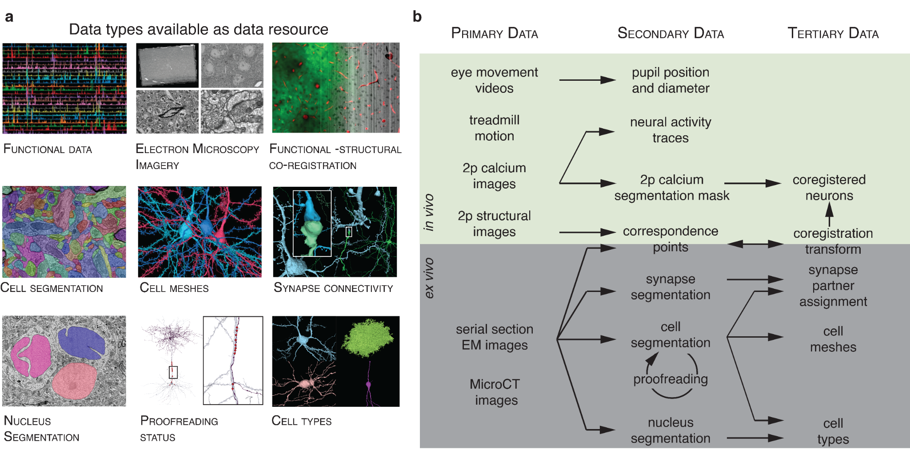
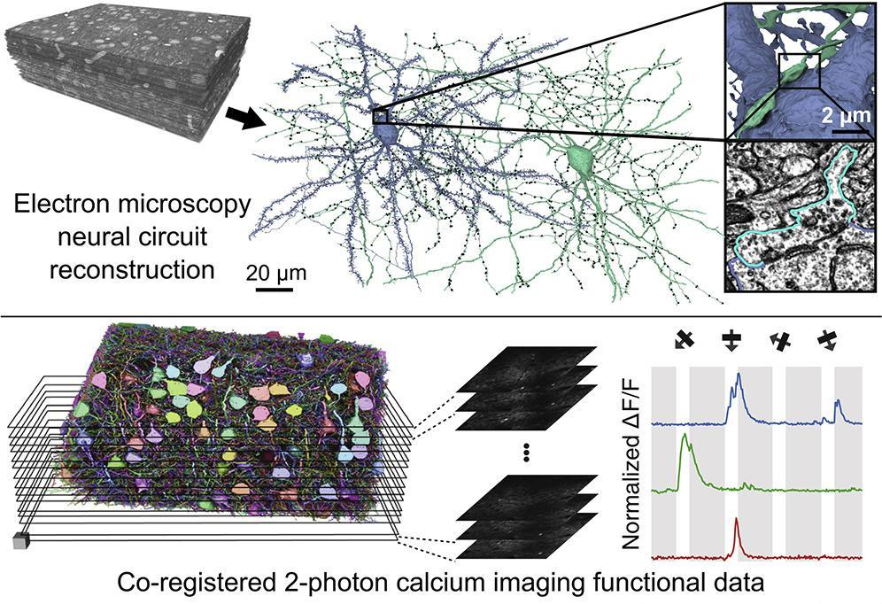
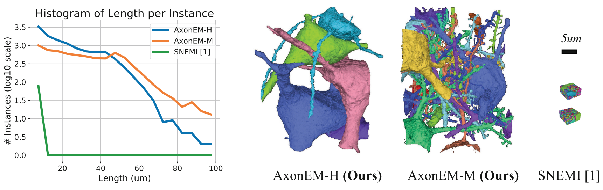
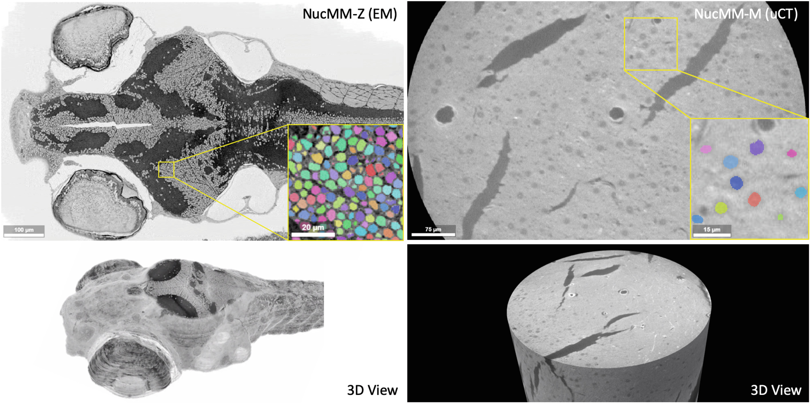
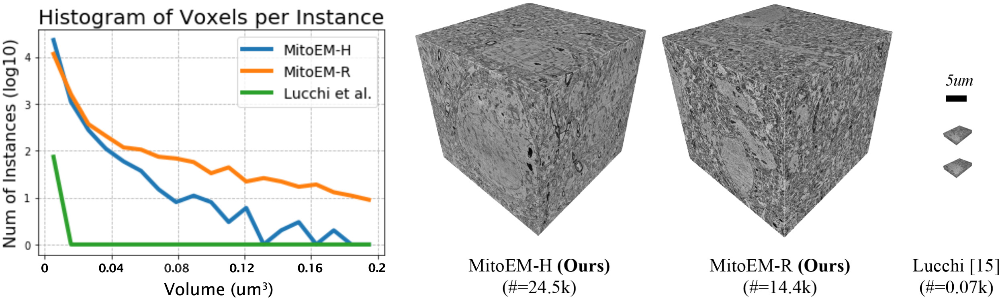
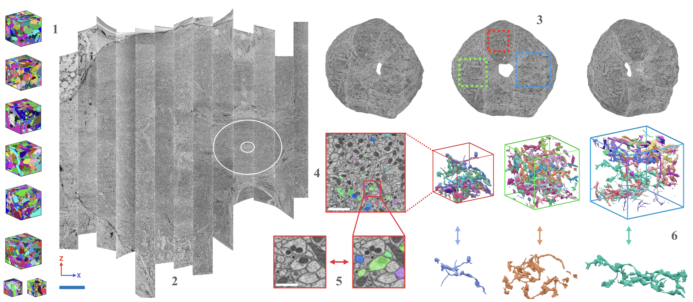
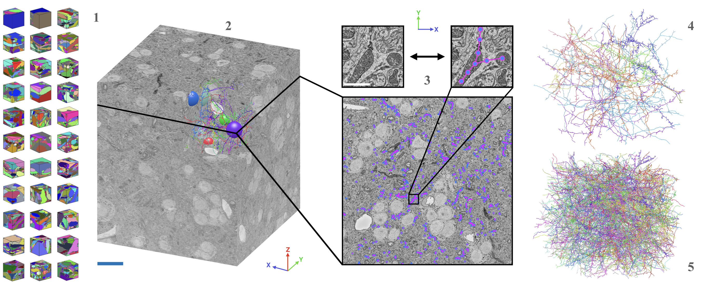
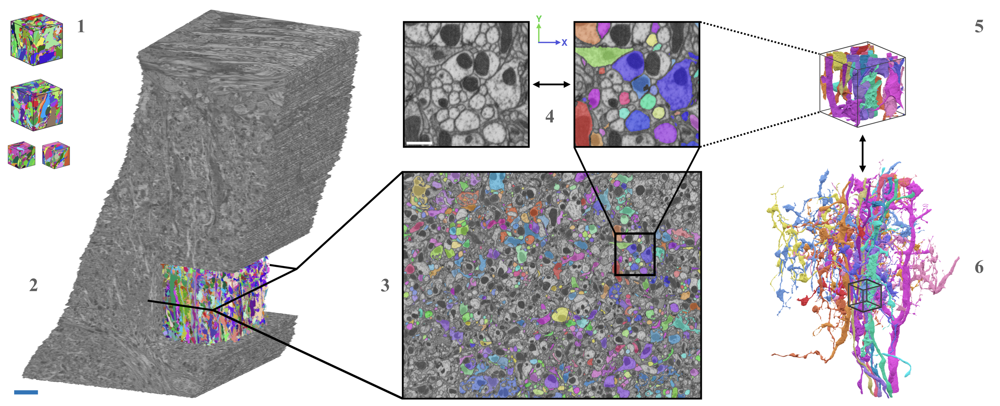
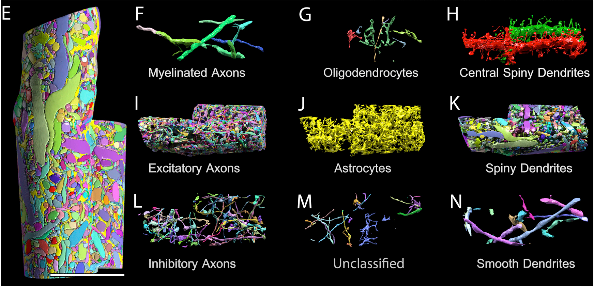

# References

*Papers behind the datasets, newest first; figures are taken from the cited papers.* &nbsp;[&larr; back to the list](README.md) · [dataset museum](DATASET.md)

[2026](#2026) · [2025](#2025) · [2024](#2024) · [2023](#2023) · [2022](#2022) · [2021](#2021) · [2020](#2020) · [2019](#2019) · [2018](#2018) · [2017](#2017) · [2016](#2016) · [2015](#2015) · [2014](#2014) · [2013](#2013) · [2011](#2011) · [1986](#1986)

## 2026

### Berg *et al.*
[Sexual Dimorphism in the Complete Drosophila Male Central Nervous System Connectome](https://www.cell.com/cell/fulltext/S0092-8674(26)00942-6) <i>Cell</i>; published version of the 2025 preprint (Male CNS)

### Bates *et al.*
[Distributed Control Circuits across a Brain-and-Cord Connectome](https://doi.org/10.1038/s41586-026-10735-w) <i>Nature</i>; published version of the 2025 preprint (BANC)

### Zheng *et al.*
[Hippocampal CA3 Connectomics Reveals a Gradient of Mossy Fiber Inputs and Selective Feedforward Inhibition onto Pyramidal Cells](https://doi.org/10.1038/s41593-026-02388-9) <i>Nature Neuroscience</i>; mouse CA3

### Perks *et al.*
[Connectome Analysis of a Cerebellum-like Circuit for Sensory Prediction](https://doi.org/10.1038/s41586-026-10690-6) <i>Nature</i>; electric fish electrosensory lobe

### Bao *et al.*
[Recurrent Synapses between CO2-sensitive Olfactory Sensory Neurons Enable Robust CO2 Detection in Aedes aegypti Mosquitoes](https://doi.org/10.1371/journal.pbio.3003959) <i>PLOS Biology</i>; mosquito antennal lobe

### Ferraioli *et al.*
[The 3D Architecture of the Ctenophore Aboral Organ and the Evolution of Complex Integrative Centers in Animals](https://doi.org/10.1126/sciadv.aea8399) <i>Science Advances</i>; ctenophore

### Gillet *et al.*
[A Multi-resolution Imaging and Analysis Pipeline for Comparative Circuit Reconstruction in Insects](https://doi.org/10.64898/2026.02.25.708065) preprint; central complex of six insect species

### Pedigo *et al.*
[A Quantitative Census of Millions of Postsynaptic Structures in a Large Electron Microscopy Volume of Mouse Visual Cortex](https://doi.org/10.64898/2026.02.19.706834) preprint; MICrONS

## 2025

### MICrONS Consortium.
[Functional Connectomics Spanning Multiple Areas of Mouse Visual Cortex](https://doi.org/10.1038/s41586-025-08790-w) published version of the 2021 bioRxiv preprint

Companion papers in the same <i>Nature</i> package ([collection](https://www.nature.com/collections/bdigiaicbd)): [inhibitory connectomic census](https://doi.org/10.1038/s41586-024-07780-8) (Schneider-Mizell <i>et al.</i>), [functional wiring rule](https://doi.org/10.1038/s41586-025-08840-3) (Ding <i>et al.</i>), [perisomatic cell typing](https://doi.org/10.1038/s41586-024-07765-7) (Elabbady <i>et al.</i>), [NEURD automated proofreading](https://doi.org/10.1038/s41586-025-08660-5) (Celii <i>et al.</i>)

### Nern *et al.*
[Connectome-driven Neural Inventory of a Complete Visual System](https://doi.org/10.1038/s41586-025-08746-0) <i>Nature</i>; male optic lobe

### Bates *et al.*
[Distributed Control Circuits across a Brain-and-Cord Connectome](https://doi.org/10.1101/2025.07.31.667571) preprint (BANC); published in 2026

### Berg *et al.*
[Sexual Dimorphism in the Complete Connectome of the Drosophila Male Central Nervous System](https://doi.org/10.1101/2025.10.09.680999) preprint (Male CNS); published in 2026

### Verasztó *et al.*
[Whole-body Connectome of a Segmented Annelid Larva](https://doi.org/10.7554/eLife.97964) <i>eLife</i>; Platynereis

### Cook *et al.*
[Comparative Connectomics of Two Distantly Related Nematode Species Reveals Patterns of Nervous System Evolution](https://doi.org/10.1126/science.adx2143) <i>Science</i>; Pristionchus vs. C. elegans

### Jokura *et al.*
[Neural Connectome of the Ctenophore Statocyst](https://doi.org/10.7554/eLife.108420) <i>eLife</i>

### Zhang *et al.*
[Ultrastructural Reconstruction of the Endodermal Nerve Net of Hydra vulgaris](https://www.cell.com/current-biology/abstract/S0960-9822(25)01309-0) <i>Current Biology</i>

### Makarova *et al.*
[The First Complete 3D Reconstruction and Morphofunctional Mapping of an Insect Eye](https://doi.org/10.7554/eLife.103247) <i>eLife</i>; Megaphragma

### Rother *et al.*
[The Songbird Basal Ganglia Connectome](https://doi.org/10.1101/2025.10.25.684569) preprint

### Corteze *et al.*
[Large-scale 3D EM Connectomics Dataset of Mouse Hippocampal Area CA1](https://doi.org/10.1101/2025.04.04.647285) preprint

### Grasso *et al.*
[Connectomic Traces of Hebbian Plasticity in the Entorhinal-Hippocampal System](https://doi.org/10.1101/2025.04.07.647631) preprint

### Fish1 Consortium (Lichtman / Engert / Google).
[A Connectomic Resource for Neural Cataloguing and Circuit Dissection of the Larval Zebrafish Brain](https://doi.org/10.1101/2025.06.10.658982) preprint (Fish1)

### ION-CAS.
[Multiplexed Neuromodulatory-type-annotated Whole-brain EM-reconstruction of Larval Zebrafish](https://doi.org/10.1101/2025.06.12.659365) preprint; Institute of Neuroscience, Chinese Academy of Sciences

### Boulanger-Weill *et al.*
[Correlative Light and Electron Microscopy Reveals the Fine Circuit Structure underlying Evidence Accumulation in Larval Zebrafish](https://doi.org/10.1101/2025.03.14.643363) preprint

### Glausier *et al.*
[Volume Electron Microscopy Reveals 3D Synaptic Nanoarchitecture in Postmortem Human Prefrontal Cortex](https://www.cell.com/iscience/fulltext/S2589-0042(25)01008-9) <i>iScience</i>; human DLPFC

### Plaza-Alonso *et al.*
[Volume Electron Microscopy Reveals Unique Laminar Synaptic Characteristics in the Human Entorhinal Cortex](https://doi.org/10.7554/eLife.96144) human MEC

### Liu *et al.*
[MitoEM 2.0: A Benchmark for Challenging 3D Mitochondria Instance Segmentation from EM Images](https://doi.org/10.1101/2025.11.12.687478) preprint

### Brown *et al.*
[ConnectomeBench: Can LLMs Proofread the Connectome?](https://arxiv.org/abs/2511.05542) NeurIPS 2025

### Muth *et al.*
[SynapseNet: Deep Learning for Automatic Synapse Reconstruction](https://doi.org/10.1091/mbc.E24-11-0519) <i>Molecular Biology of the Cell</i>; electron tomography

## 2024

### Dorkenwald *et al.*
[Neuronal Wiring Diagram of an Adult Brain](https://doi.org/10.1038/s41586-024-07558-y) FlyWire connectome of FAFB

### Schlegel *et al.*
[Whole-brain Annotation and Multi-connectome Cell Typing of Drosophila](https://doi.org/10.1038/s41586-024-07686-5)

### Matsliah *et al.*
[Neuronal Parts List and Wiring Diagram for a Visual System](https://doi.org/10.1038/s41586-024-07981-1) FlyWire optic lobe

### Shapson-Coe *et al.*
[A Petavoxel Fragment of Human Cerebral Cortex Reconstructed at Nanoscale Resolution](https://doi.org/10.1126/science.adk4858) published version of the 2021 bioRxiv preprint (H01)

### Sievers *et al.*
[Connectomic Reconstruction of a Cortical Column](https://doi.org/10.1101/2024.03.22.586254) preprint

### Vishwanathan *et al.*
[Predicting Modular Functions and Neural Coding of Behavior from a Synaptic Wiring Diagram](https://doi.org/10.1038/s41593-024-01784-3) zebrafish oculomotor integrator

### Cano-Astorga *et al.*
[Volume Electron Microscopy Analysis of Synapses in Primary Regions of the Human Cerebral Cortex](https://doi.org/10.1093/cercor/bhae312) human BA17 / BA3b / BA4

### Takemura *et al.*
[A Connectome of the Male Drosophila Ventral Nerve Cord](https://doi.org/10.7554/eLife.97769) <i>eLife</i> (MANC)

### Marin *et al.*
[Systematic Annotation of a Complete Adult Male Drosophila Nerve Cord Connectome Reveals Principles of Functional Organisation](https://doi.org/10.7554/eLife.97766) <i>eLife</i> (MANC)

### Cheong *et al.*
[Organization of Circuits Linking Descending Input to Motor Output in the Drosophila Male Adult Nerve Cord Connectome](https://doi.org/10.7554/eLife.96084) <i>eLife</i> (MANC)

### Azevedo *et al.*
[Connectomic Reconstruction of a Female Drosophila Ventral Nerve Cord](https://doi.org/10.1038/s41586-024-07389-x) <i>Nature</i> (FANC)

### Eckstein *et al.*
[Neurotransmitter Classification from Electron Microscopy Images at Synaptic Sites in Drosophila melanogaster](https://doi.org/10.1016/j.cell.2024.03.016) <i>Cell</i>

### Kuan *et al.*
[Synaptic Wiring Motifs in Posterior Parietal Cortex Support Decision-making](https://doi.org/10.1038/s41586-024-07088-7) <i>Nature</i>; mouse PPC

### Yim *et al.*
[Comparative Connectomics of Dauer Reveals Developmental Plasticity](https://doi.org/10.1038/s41467-024-45943-3) <i>Nature Communications</i>; C. elegans dauer

### Li *et al.*
[WASPSYN: A Challenge for Domain Adaptive Synapse Detection in Microwasp Brain Connectomes](https://doi.org/10.1109/TMI.2024.3400276) <i>IEEE TMI</i>; ISBI 2023 challenge

### Zhang *et al.*
[SegNeuron: 3D Neuron Instance Segmentation in Any EM Volume with a Generalist Model](https://doi.org/10.1007/978-3-031-72111-3_55) MICCAI 2024; EMNeuron

### Wan *et al.*
[TriSAM: Tri-Plane SAM for Zero-shot Cortical Blood Vessel Segmentation in VEM Images](https://arxiv.org/abs/2401.13961) BvEM

### Lu *et al.*
[Diffusion-based Deep Learning Method for Augmenting Ultrastructural Imaging and Volume Electron Microscopy](https://doi.org/10.1038/s41467-024-49125-z) <i>Nature Communications</i>; EMDiffuse

## 2023

### Winding *et al.*
[The Connectome of an Insect Brain](https://doi.org/10.1126/science.add9330) whole-brain connectome of larval Drosophila

### Nguyen *et al.*
[Structured Cerebellar Connectivity Supports Resilient Pattern Separation](https://doi.org/10.1038/s41586-022-05471-w)

### Karlupia *et al.*
[Immersion Fixation and Staining of Multicubic Millimeter Volumes for Electron Microscopy-Based Connectomics of Human Brain Biopsies](https://doi.org/10.1016/j.biopsych.2023.01.025)

### Bidel *et al.*
[Connectomics of the Octopus vulgaris Vertical Lobe Provides Insight into Conserved and Novel Principles of a Memory Acquisition Network](https://doi.org/10.7554/eLife.84257) <i>eLife</i>

### Burkhardt *et al.*
[Syncytial Nerve Net in a Ctenophore Adds Insights on the Evolution of Nervous Systems](https://doi.org/10.1126/science.ade5645) <i>Science</i>

### Chua *et al.*
[A Complete Reconstruction of the Early Visual System of an Adult Insect](https://www.cell.com/current-biology/fulltext/S0960-9822(23)01237-X) <i>Current Biology</i>; Megaphragma

### Wildenberg *et al.*
[Isochronic Development of Cortical Synapses in Primates and Mice](https://doi.org/10.1038/s41467-023-43088-3) <i>Nature Communications</i>

### Conrad *and* Narayan.
[Instance Segmentation of Mitochondria in Electron Microscopy Images with a Generalist Deep Learning Model Trained on a Diverse Dataset](https://doi.org/10.1016/j.cels.2022.12.006) <i>Cell Systems</i>; CEM1.5M, CEM-MitoLab, MitoNet

### Sheridan *et al.*
[Local Shape Descriptors for Neuron Segmentation](https://doi.org/10.1038/s41592-022-01711-z) <i>Nature Methods</i>

### Song *et al.*
[High-contrast En Bloc Staining of Mouse Whole-brain and Human Brain Samples for EM-based Connectomics](https://doi.org/10.1038/s41592-023-01866-3) <i>Nature Methods</i>

## 2022

### Loomba *et al.*
[Connectomic Comparison of Mouse and Human Cortex](https://doi.org/10.1126/science.abo0924)

### Svara *et al.*
[Automated Synapse-level Reconstruction of Neural Circuits in the Larval Zebrafish Brain](https://doi.org/10.1038/s41592-022-01621-0) mapzebrain

### Turner *et al.*
[Reconstruction of Neocortex: Organelles, Compartments, Cells, Circuits, and Activity](https://doi.org/10.1016/j.cell.2022.01.023)

## 2021

### Wei *et al.*
[AxonEM Dataset: 3D Axon Instance Segmentation of Brain Cortical Regions](https://doi.org/10.1007/978-3-030-87193-2_17)

### Shapson-Coe *et al.*
[A Connectomic Study of a Petascale Fragment of Human Cerebral Cortex](https://www.biorxiv.org/content/10.1101/2021.05.29.446289v4)

### MICrONS Consortium *et al.*
[Functional Connectomics Spanning Multiple Areas of Mouse Visual Cortex](https://www.biorxiv.org/content/10.1101/2021.07.28.454025v2)

### Lin *et al.*
[NucMM Dataset: 3D Neuronal Nuclei Instance Segmentation at Sub-Cubic Millimeter Scale](https://doi.org/10.1007/978-3-030-87193-2_16)

### Phelps *et al.*
[Reconstruction of Motor Control Circuits in Adult Drosophila using Automated Transmission Electron Microscopy](https://doi.org/10.1016/j.cell.2020.12.013) FANC

### Witvliet *et al.*
[Connectomes across Development Reveal Principles of Brain Maturation](https://doi.org/10.1038/s41586-021-03778-8)

### Gour *et al.*
[Postnatal Connectomic Development of Inhibition in Mouse Barrel Cortex](https://doi.org/10.1126/science.abb4534)

### Hua *et al.*
[Electron Microscopic Reconstruction of Neural Circuitry in the Cochlea](https://doi.org/10.1016/j.celrep.2020.108551)

### Brittin *et al.*
[A Multi-scale Brain Map Derived from Whole-brain Volumetric Reconstructions](https://doi.org/10.1038/s41586-021-03284-x) <i>Nature</i>; C. elegans nerve ring

### Vergara *et al.*
[Whole-body Integration of Gene Expression and Single-cell Morphology](https://www.cell.com/cell/fulltext/S0092-8674(21)00876-X) <i>Cell</i>; Platynereis

### Sayre *et al.*
[A Projectome of the Bumblebee Central Complex](https://doi.org/10.7554/eLife.68911) <i>eLife</i>

### Wildenberg *et al.*
[Primate Neuronal Connections Are Sparse in Cortex as Compared to Mouse](https://doi.org/10.1016/j.celrep.2021.109709) <i>Cell Reports</i>

### Heinrich *et al.*
[Whole-cell Organelle Segmentation in Volume Electron Microscopy](https://doi.org/10.1038/s41586-021-03977-3) <i>Nature</i>; OpenOrganelle

### Xu *et al.*
[An Open-access Volume Electron Microscopy Atlas of Whole Cells and Tissues](https://doi.org/10.1038/s41586-021-03992-4) <i>Nature</i>; OpenOrganelle

## 2020

### Wei *et al.*
[MitoEM Dataset: Large-Scale 3D Mitochondria Instance Segmentation from EM Images](https://doi.org/10.1007/978-3-030-59722-1_7)

### Scheffer *et al.*
[A connectome and analysis of the adult Drosophila central brain](https://doi.org/10.7554/eLife.57443)

### Wanner *and* Friedrich.
[Whitening of Odor Representations by the Wiring Diagram of the Olfactory Bulb](https://doi.org/10.1038/s41593-019-0576-z) zebrafish OB connectome

### Montero-Crespo *et al.*
[Three-dimensional Synaptic Organization of the Human Hippocampal CA1 Field](https://doi.org/10.7554/eLife.57013) human CA1

## 2019

### Motta *et al.*
[Dense Connectomic Reconstruction in Layer 4 of the Somatosensory Cortex](https://doi.org/10.1126/science.aay3134) L4dense

### Cook *et al.*
[Whole-animal Connectomes of Both Caenorhabditis elegans Sexes](https://doi.org/10.1038/s41586-019-1352-7)

### Hong *et al.*
[Evolution of Neuronal Anatomy and Circuitry in Two Highly Divergent Nematode Species](https://doi.org/10.7554/eLife.47155) <i>eLife</i>; Pristionchus amphid

## 2018

### Januszewski *et al.*
[High-precision automated reconstruction of neurons with flood-filling networks](https://doi.org/10.1038/s41592-018-0049-4)

### Zheng *et al.*
[A Complete Electron Microscopy Volume of the Brain of Adult Drosophila melanogaster](https://doi.org/10.1016/j.cell.2018.06.019) FAFB

### Svara *et al.*
[Volume EM Reconstruction of Spinal Cord Reveals Wiring Specificity in Speed-Related Motor Circuits](https://doi.org/10.1016/j.celrep.2018.05.023)

### Bae *et al.*
[Digital Museum of Retinal Ganglion Cells with Dense Anatomy and Physiology](https://doi.org/10.1016/j.cell.2018.04.040) EyeWire museum

## 2017

### Hildebrand *et al.*
[Whole-brain Serial-section Electron Microscopy in Larval Zebrafish](https://doi.org/10.1038/nature22356)

### Kornfeld *et al.*
[EM Connectomics Reveals Axonal Target Variation in a Sequence-generating Network](https://doi.org/10.7554/eLife.24364) zebra finch HVC

### Eichler *et al.*
[The Complete Connectome of a Learning and Memory Centre in an Insect Brain](https://doi.org/10.1038/nature23455) larval Drosophila mushroom body

### Schmidt *et al.*
[Axonal Synapse Sorting in Medial Entorhinal Cortex](https://doi.org/10.1038/nature24005) mouse MEC

### Vishwanathan *et al.*
[Electron Microscopic Reconstruction of Functionally Identified Cells in a Neural Integrator](https://doi.org/10.1016/j.cub.2017.06.028) zebrafish hindbrain

### Gerhard *et al.*
[Conserved Neural Circuit Structure across Drosophila Larval Development Revealed by Comparative Connectomics](https://doi.org/10.7554/eLife.29089) <i>eLife</i>

## 2016

### Wanner *et al.*
[3-dimensional Electron Microscopic Imaging of the Zebrafish Olfactory Bulb and Dense Reconstruction of Neurons](https://doi.org/10.1038/sdata.2016.100)

### Morgan *et al.*
[The Fuzzy Logic of Network Connectivity in Mouse Visual Thalamus](https://doi.org/10.1016/j.cell.2016.02.033) dLGN

### Lee *et al.*
[Anatomy and Function of an Excitatory Network in the Visual Cortex](https://doi.org/10.1038/nature17192)

### Ryan *et al.*
[The CNS Connectome of a Tadpole Larva of Ciona intestinalis (L.) Highlights Sidedness in the Brain of a Chordate Sibling](https://doi.org/10.7554/eLife.16962) <i>eLife</i>; first chordate CNS connectome

## 2015

### Takemura *et al.*
[Synaptic circuits and their variations within different columns in the visual system of Drosophila](https://doi.org/10.1073/pnas.1509820112)

### Kasthuri *et al.*
[Saturated Reconstruction of a Volume of Neocortex](https://doi.org/10.1016/j.cell.2015.06.054)

### Kisuk Lee *et al.*
[Recursive Training of 2D-3D Convolutional Networks for Neuronal Boundary Prediction](https://proceedings.neurips.cc/paper/2015/hash/39dcaf7a053dc372fbc391d4e6b5d693-Abstract.html)

### Ohyama *et al.*
[A Multilevel Multimodal Circuit Enhances Action Selection in Drosophila](https://doi.org/10.1038/nature14297) L1 larval CNS volume

### Berning *et al.*
[SegEM: Efficient Image Analysis for High-Resolution Connectomics](https://doi.org/10.1016/j.neuron.2015.09.003)

## 2014

### Kim *et al.*
[Space-time Wiring Specificity Supports Direction Selectivity in the Retina](https://doi.org/10.1038/nature13240) EyeWire

## 2013

### Gerhard *et al.*
[Segmented anisotropic ssTEM dataset of neural tissue](https://www.zora.uzh.ch/id/eprint/91121/)

### Helmstaedter *et al.*
[Connectomic Reconstruction of the Inner Plexiform Layer in the Mouse Retina](https://doi.org/10.1038/nature12346) e2006, first dense mammalian connectome

### Takemura *et al.*
[A Visual Motion Detection Circuit Suggested by Drosophila Connectomics](https://doi.org/10.1038/nature12450)

## 2011

### Bock *et al.*
[Network Anatomy and In Vivo Physiology of Visual Cortical Neurons](https://doi.org/10.1038/nature09802)

### Briggman *et al.*
[Wiring Specificity in the Direction-selectivity Circuit of the Retina](https://doi.org/10.1038/nature09818) e2198

## 1986

### White *et al.*
[The Structure of the Nervous System of the Nematode Caenorhabditis elegans](https://doi.org/10.1098/rstb.1986.0056) the first complete connectome
